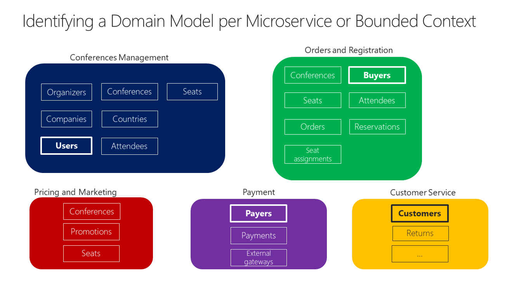
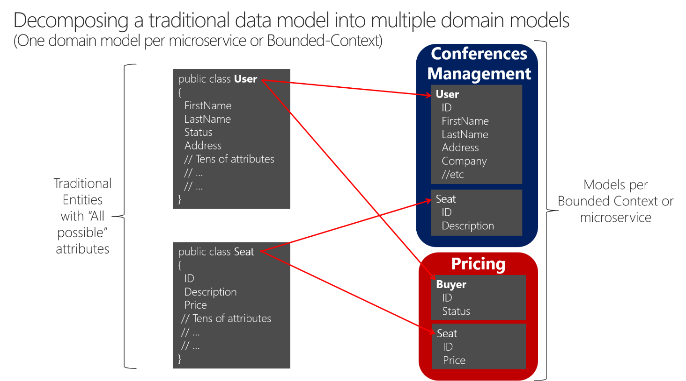

# 标识每个微服务的域模型边界

在划分微服务模型边界和大小时，说是应该尽可能的小，但目的不是用力达到最细粒度分离。
应该在域知识的指导下 **实现最有意义的分离，重点不是大小，而是业务功能**。
此外，如果基于大量依赖项的应用进程的某个区域需要明确的内聚，则表明也需要单个微服务。

内聚是一种确定如何拆分或组合微服务的方法。

微服务的大小不是一蹴而就，是一个逐步迭代调整的过程。

## 上下文映射模式 (Context Mapping pattern)

**上下文映射是一种定义和明确域之间边界的方法**。使用上下文映射，可以识别应用进程中的各种上下文及其边界。

常用设计方法有：

1. 分离方式（separate way）
2. 防腐层（anti corruption layer，ACL）
3. 客户-供应（customer/supplier）
4. 发布-订阅（publisher/subscriber）
5. 开放式主机（open host service, OHS）
6. 合作者（partnership）
7. 遵奉者（conformist）
8. 共享内核（Shared Kernel）

> 比如：来自类目领域的领域专家将以不同于运输领域专家的方式命名类目和库存领域的实体。
> 又比如：CRM领域专家是需要存储尽可能多的客户信息,订购专家却只需要客户的部分信息。设计出来的用户域实体的大小和属性数量可能是不同的。

很难消除与大型应用进程相关的所有领域的所有领域术语和歧义。
但关键是不应该去试图统一术语，而是需要接收每个领域的差异和丰富性。

> 如果你试图为整个应用进程创建一个统一的数据库，那么使用统一的词汇，表的字段命名会很尴尬，很难理解。而且对于任何一个多领域专家来说都是不合适的。

## 微服务的域模型应该有多大？

**它应该有一个尽可能独立的自治BC。** 这样就可以在工作时不必不断切换到其他上下文（其他微服务模型）了。

上图为联机会议管理系统的示例方案。
同一个实体显示为Users、Buyers,Payers和Customers。命名不同，但实则是共享同一标识，具体取决于边界上下文。
有些微服务仅存于单个微服务模型中。如Payment的Payments。

## 将传统数据模型分解为多个域模型

在边界上下文之间分解传统数据模型时，可以让不同的实体共享标识（如用户标识）。
上面的用户在不同的边界上下文中有着不同的特性。并且每个微服务并不需要用户实体相关的所有数据，只要一部分即可，具体取决于要解决的问题和上下文。
> 如：Pricing微服务模型中，并不需要用户的地址和名称，只要用户id和状态，这将影响每个购买者的席位价格的折扣。

不共享相同数目属性的实体的**好处**：

1. 减少了重复，微服务模型没有任何不需要的数据，保证了模型的纯粹性。
2. 拥有一个主微服务，该微服务拥有每个实体的特定类型的数据，以便对该类型的数据更新和查询仅由该微服务驱动。
