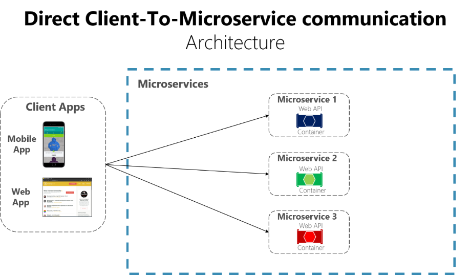
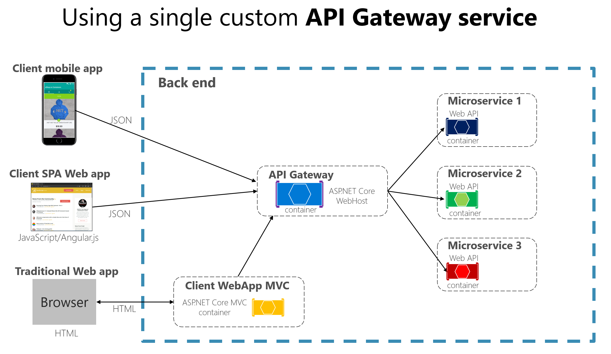
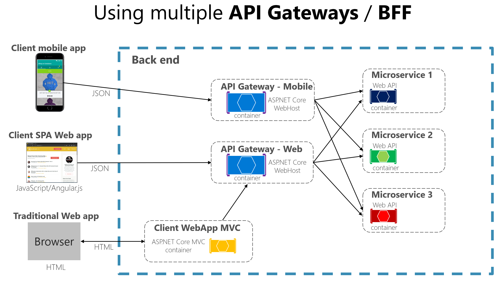

# The API gateway pattern versus the Direct client-to microservice communication

在微服务体系结构中，每个微服务公开一组（通常）细粒度终结点。 这一事实可能会影响客户端到微服务的通信。

## 客户端到微服务直接通信

一种可行的方法是使用直接客户端到微服务通信体系结构。在此方法中，客户端应用可以直接向某些微服务发出请求。


上图所示的直连体系已能满足基于微服务的小型应用程序的需求，尤其是SSR项目 （aps.net mvc应用）.
但是若要生成基于微服务的大型复杂应用程序（如处理大量微服务类型） ，尤其客户端是移动app或者spa web应用程序时，就有以下思考：

1. 客户端应用如何尽可能的减少对后端发出的请求数量？
   一个界面与多个微服务交互会增加网络中的往返次数，该方法会增加UI端的延迟时间和复杂性。理想情况是一个响应就把要的都返回回来。

2. 如何处理授权、数据转换何动态请求分发等横切关注点？
   在每个微服务上实现安全策略和整合问题需要进行大量的开发工作。一个可行的方法是在Docker主机或内部集群中提供这些服务，以限制外部直接访问它们，并在集中的地方（api网关）实现整合问题。

3. 客户端如何与使用了非网络友好协议的服务进行通信？
   客户端一般不支持服务端使用的协议（*如AMQP，二进制协议*）。因此必须通过http/s等协议的请求然后再转为其他协议。这种情况下，中间人方法可提供帮助。

4. 如何构建专为移动应用打造的外观？

   多个微服务的api可能在面向不同客户端应用时，无法很好的满足需求。
   如：移动app与PC端需求不同，对于app可能需要进一步优化，提高数据响应率（*可以通过聚合多个来自微服务的数据返回一组数据，也可以抹除app应用不需要的数据来压缩响应包*）

## 详说为什么考虑 API 网关而不考虑客户端到微服务直接通信

### 直连多个微服务的问题

1. **强耦合**
    客户端需要知道微服务中分解的多个区域。在迭代时，将会影响维护（*因为会导致客户端应用重大更改，因为直接引用了多个内部微服务*）
2. **多余的请求往返**
3. **安全性问题**
    如果没有网关，所有微服务都暴露在外面，使得攻击范围比以往大了很多。
4. **跨领域问题**
    每个公开发布的微服务都必须处理授权和SSL等问题。

## 什么是API网关模式

该模式是一项服务，为一组微服务提供单一入口点。
类似于设计模式中的外观模式，但在这里，它是分布式系统的一部分，因为构建时需考虑客户端应用的需求，所以API网关模式有时候也称之为“用于前端的后端(backend for frontend)”。

所以API网关位于客户端应用和微服务之间，充当反向代理，将客户端请求路由到微服务，还提供了跨领域功能，例如身份验证、SSL和缓存。



上图中API网关将作为自定义aps.net core webHost服务实现，并作为容器运行。

 但是也可能存在很大风险：当api网关服务将根据客户端应用的不断迭代增长而增长和发展，最终将变得很臃肿。实际上，会类似于整体式应用程序或整体式服务，违背了微服务的自主性。

 因此，强烈建议将api网关拆分成多个服务或更多更小的api网关。API 网关应根据业务边界和客户端应用进行隔离，而不是充当所有内部微服务的单个聚合器。

比下图所示：


这里显示了按*客户端类型隔离*的 API 网关：一个用于移动客户端，一个用于 Web 客户端。传统 Web 应用连接到使用 Web API 网关的 MVC 微服务。该示例描述了具有多个细粒度 API 网关的简化架构。在这种情况下，为每个 API 网关标识的**边界完全基于“前端后端”（BFF） 模式**，因此仅基于每个客户端应用所需的 API。但在较大的应用进程中，您还应该更进一步，根据业务边界创建其他 API 网关，作为第二个设计枢轴。

## API 网关模式中的主要功能

api网关可以提供多个功能，根据产品需要，可以更丰富或者更简洁。

最重要，最基本的功能采用了以下设计模式：

### 一、反向代理或网关路由

**api网关提供一个反向代理将请求(*通常是http请求*)重定向或路由到内部微服务的终结点。对外为客户端应用程序提供单个终结点或url，然后将请求映射到一组微服务。**
该路由功能有助于将客户端应用程序从微服务中分离出来；

 而且在升级整体式API服务时，将api网关放在客户端和整体式api服务之间，操作会变的很方便，然后就可以添加新的api作为心得微服务，同时仍然可以使用旧的整体式api服务，直到将来被拆分成多个微服务为止。
 这期间客户端应用并不会注意到所使用的api是微服务还是整体式api，所以不会对客户端应用造成影响。

 Nginx作为路由器示例：

``` nginx
server {
    listen 80;
    server_name domain.com;

    location /app1 {
        proxy_pass http://10.0.3.10:80;
    }

    location /app2 {
        proxy_pass http://10.0.3.20:80;
    }

    location /app3 {
        proxy_pass http://10.0.3.30:80;
    }
}
```

更多请看[网关路由模式](https://learn.microsoft.com/zh-cn/azure/architecture/patterns/gateway-routingJ)

### 二、请求聚合

将针对多个内部微服务的多个客户端请求（通常是 HTTP 请求）聚合到一个客户端请求中。当客户端页面/屏幕需要来自多个微服务的信息时，此模式特别方便

使用这种方法，客户端应用进程向 API 网关发送单个请求，API 网关将多个请求分派给内部微服务，然后聚合结果并将所有内容发送回客户端应用进程。

这种设计模式的主要好处和目标是减少客户端应用进程和后端 API 之间的多余沟通，这对于微服务所在的数据中心之外的远程应用进程尤其重要（*例如移动应用进程或来自来自 SPA 应用进程的请求客户端远程浏览器中的 JavaScript。对于在服务器环境中执行请求的常规 Web 应用进程（如 ASP.NET Core MVC Web 应用进程），此模式并不重要，因为延迟比远程客户端应用进程小得多。*）

更多请看[网关聚合模式](https://learn.microsoft.com/zh-cn/azure/architecture/patterns/gateway-aggregation)

### 三、跨领域或网关卸载

将功能从单个微服务转移到网关，从而通过将跨领域问题整合到一个层级中来简化每个微服务的饿实现。
比如：

1. 身份验证和授权
2. 服务发现继承
3. 相应缓存
4. 重试策略、断路器和Qos
5. 速率限制和遏制
6. 负载均衡
7. 日志记录、跟踪，关联
8. 标头、查询字符串和声明转换
9. IP允许列表

更多请看[网关卸载模式](https://learn.microsoft.com/zh-cn/azure/architecture/patterns/gateway-offloading)

## 有API网关功能的产品

### Ocelot

Ocelot 是一个轻量级的 API 网关，推荐用于更简单的方法。 Ocelot 是一个基于 .NET Core 的开源 API 网关，专为需要进入其系统的统一入口点的微服务架构而设计。它轻巧、快速且可扩展，并提供路由和身份验证以及许多其他功能

前面的图表显示在容器中运行自定义 API 网关，正是在容器和基于微服务的应用程序中运行 Ocelot 的方式。

此外，市场上还有很多其他产品提供 API 网关功能，比如 Apigee、Kong、MuleSoft、WSO2，以及提供服务网格入口控制器功能的 Linkerd 和 Istio 等其他产品。

## API 网关模式的缺点

- 实现api网关时，会将该层与内部微服务进行耦合，这是它的最大缺点。*此类耦合可能会给应用程序带来严重问题*
  
- 使用微服务 API 网关会产生额外的可能单点故障。
  
- 由于额外的网络调用，API 网关可能会增加响应时间。 但是，与直接调用内部微服务的客户端接口相比，这种额外的调用通常影响较小。
  
- 如果未正确横向扩展，API 网关可能会成为瓶颈。
  
- 如果 API 网关包含自定义逻辑和数据聚合，则需要额外的开发成本和未来的维护。（*开发人员必须更新 API 网关才能公开每个微服务的终结点。此外，内部微服务中的实现更改可能会导致 API 网关级别的代码更改。但是，如果 API 网关仅应用安全性、日志记录和版本控制（如使用 Azure API 管理时），则此额外开发成本可能不适用*)
  
- 如果 API 网关由单个团队开发，则可能存在开发瓶颈。这方面是更好的方法是拥有多个细粒度的 API 网关来响应不同客户需求的另一个原因。还可以在内部将 API 网关隔离为多个区域或层，这些区域或层由处理内部微服务的不同团队拥有。
