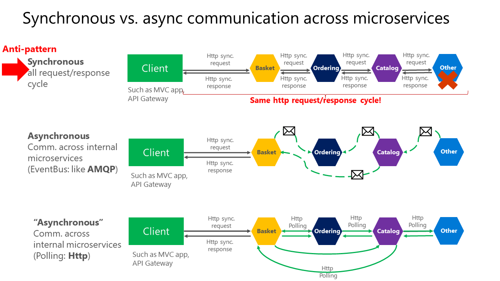
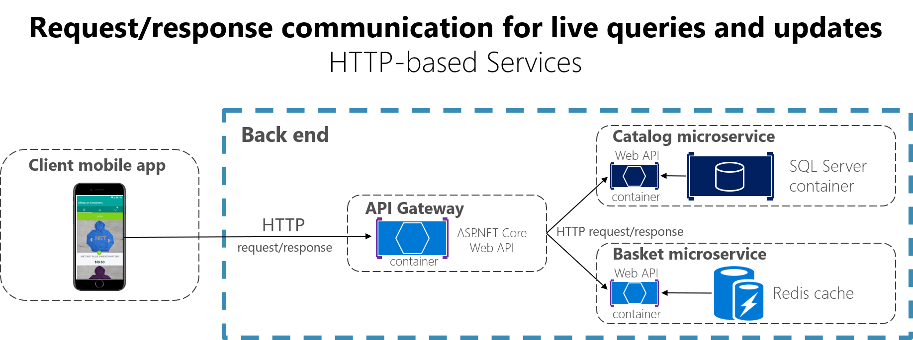
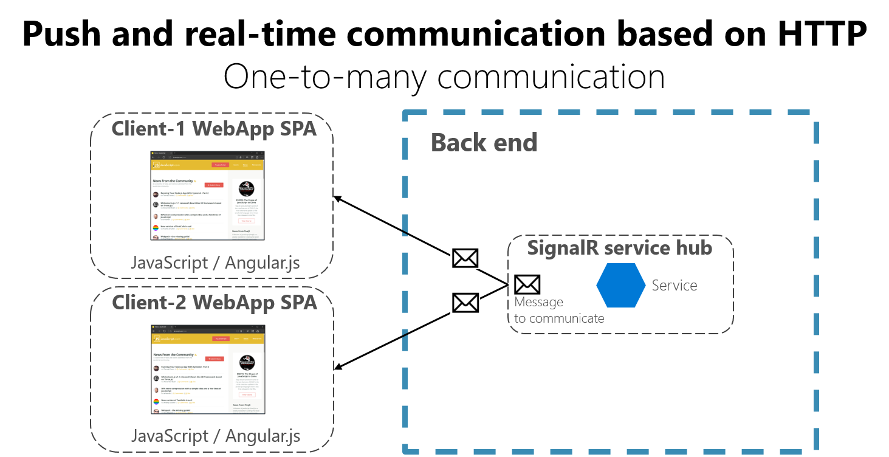

# 微服务体系结构中的通信

在单个进程中运行的整体式应用程序，组件使用语言级别方法或函数互相调用。如果你使用代码`var send = new MsgSend()`创建对象，则它们是强耦合的。如果你通过引用抽象而不是具体的对象实例的方式依赖注入，则可以以解耦的方式调用他们。
无论那种方式，对象都在同一进程里运行。
从整体式应用程序转变为基于微服务的应用，最大的挑战在于**改变通信机制**。*而将进程内方法调用直接转换为对服务的RPC调用将在分布式环境种导致效果不佳且效率低下的通信。*

解决方案有很多，起码应该包括**应该尽可能多的隔离业务微服务**。然后使用微服务之间的*异步通信*，并将对象之间的进程内通信中常见的细粒度通信**替换为粗粒度通信**。 （*可以对调用进行分组，并将聚合多个内部调用结果的数据返回到客户端*）

 微服务架构是在多个进程，服务甚至于多个服务器上运行的分布式系统。每个服务实例通常都是一个进程，因此**服务必须使用进程间通信协议（如Http,AMQP）或二进制协议（如TCP）进行交互**，具体取决于每个服务的性质。

## 通信类型

客户端和服务可以通过很多不同类型的通信进行通信，每个通信面向不同的方案和目标
最初，这些类型的通信可以分为两个轴：

第一个轴定义协议是同步的还是异步的：

- 同步协议。*协议（HTTP / HTTPS）是同步的，客户端代码只有在收到HTTP服务器响应时才能继续其任务。*
- 异步协议。*其他协议如AMQP（许多操作系统和云环境支持的协议）使用异步消息。客户端代码或消息发送方通常不会等待响应。它只是像向 RabbitMQ 队列或任何其他消息代理发送消息一样发送消息*
  
第二个轴定义通信是具有单个接收方还是多个接收方：

- 单个接收方。*每个请求必须仅由一个接收方或服务处理。此通信的一个示例是命令模式。*
- 多个接收方。*每个请求可以由零到多个接收方处理。这种类型的通信必须是异步的。一个例子是事件驱动架构等模式中使用的**发布/订阅机制**。这**基于事件总线接口或消息代理**，通过事件在多个微服务之间传播数据更新;**它通常通过使用主题和订阅通过服务总线或类似项目（如 Azure 服务总线）实现***

基于微服务的应用会使用上面方式的组合。
*如：调用常规web api http服务时使用同步协议的单接收方通信，*
*使用消息传递协议进行微服务之间的异步通信。*

这两个轴了解下就行了，它们不是构建微服务时的重要问题。
**重要的是能够异步集成微服务，同时保持微服务的独立性。**

## 异步微服务集成强化微服务的自治性

 构建基于微服务重要的便是集成微服务的方法。理想情况下，应该尽量减少内部微服务之间的通信。微服务之间的通信越少越好。但在很多时候，必须要以某种方式集成微服务。
 当需要集成时，关键的规则是**微服务之间的通信应该是异步的**。当然并不是说必须使用特定协议。只是意味着微服务之间的通信**应该只通过异步传播数据来完成，并且不要依赖其他内部微服务作为初始服务http请求的一部分。**

 如下图所示：
 

 永远不要依赖多个微服务之间的同步通信，不仅会使微服务不自治，而且只要其中一项服务表现不好，性能就会受到影响。**这是一种反模式**

 在异步通信中，微服务使用异步消息或http轮询与其他微服务通信，这样就会立即处理客户端请求。

如果真的需要在另一个微服务中引发其他操作，**请不要同步执行该操作，也不要作为原始微服务请求和回复操作的一部分执行。请以异步（异步消息传递/集成事件，队列等）执行。**

最后⭐，如果初始微服务需要最初由其他微服务拥有的数据，也请不要对该数据发出同步请求。应该**使用最终一致性（通常是集成事件）将该数据（不是整个实体而是需要的属性）复制或传播到初始服务的数据库中。**

如前文[标识每个微服务的域模型边界](/12_识别每个微服务的域模型边界/index.md)所述，跨多个微服务复制某些数据并不是设计错误。这里把数据转换为了该附加域或边界上下文的特定语言或术语。

> 可以使用任何协议在微服务之间异步通信和传播数据，以实现最终的一致性。可以通过事件总线或消息代理使用集成事件，或者甚至可以通过轮询其他服务来使用HTTP。这不重要，重要的是不在微服务之间创建同步依赖。

## 通信style✨

**通信类型**
有很多用于通信的协议和选项。
如过使用基于同步请求/响应的通信机制，那么http和REST等协议方法是最常见的。*尤其是将服务发布到docker主机或微服务集群以外的情况下*。
如果在内部进行服务间通信，那么建议使用二进制格式通信机制（如TPC和二进制格式的WCF），或者基于消息的异步通信机制（AMQP）。

**消息格式**
由JSON、XML或者更高效的二进制消息格式。
如果选择的二进制格式不是标准格式，那么最好不要作为公开的服务补发。*非标准格式的可以用在微服务之间内部通信（在Docker主机或微服务集群中的微服务之间通信，或与微服务通信的专用客户端通信，可以用此）*

### 使用HTTP和REST进行请求/响应通信

客户端使用请求/响应通信时，它会向服务发送请求，然后服务处理并返回响应。
**特别适合从客户端应用查询实时界面的数据，因此这种方式大多用于查询。**

这种方式我们假定它会在短时间（不到一秒或者最多几秒）内到达。
*如果是延迟的响应，则需要基于消息传递模式和消息传递技术实现异步通信。下节详说*

 请求/响应的常用体系结构样式是REST，该方法基于HTTP协议并于该协议紧密耦合，接收Get，Post，Put，Delete等Http谓词。
 REST是创建服务时最常用的架构通信方式。

### 基于HTTP的推送和实时通信

另一种可能性（通常用于与REST不同的目的）是与更高级别的框架（如 ASP.NET SignalR）和协议（如WebSockets）进行实时和一对多通信。

实时 HTTP 通信意味着可以让服务器代码在数据可用时将内容推送到连接的客户端，而不是让服务器等待客户端请求新数据。

SignalR 是实现实时通信的好方法，以便将内容从后端服务器推送到客户端。由于通信是实时的，因此客户端应用几乎可以立即显示更改。 这通常由 WebSocket 等协议处理，使用许多 WebSockets 连接（每个客户端一个）。*一个典型的示例是，当服务同时将体育比赛分数的变化传达给多个客户端 Web 应用时。*
