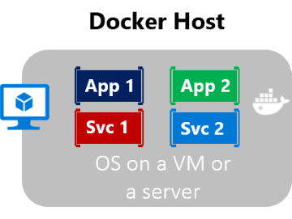

# 容器技术

## 什么是容器化

容器化是软件开发的一种方法，通过该方法可将应用程序或服务、其依赖项及其配置（抽象化为部署清单文件）一起打包为容器映像

## 优势

1. 容器化应用程序可以作为一个单元进行测试，并可以作为容器映像实例部署到主机操作系统 (OS)
2. 在共享 OS 上将应用程序彼此隔离开

3. **可伸缩性**

通过为短期任务创建新容器，可以快速扩大

出于可靠性考虑，在多个主机服务器上运行同一映像的多个实例时，通常要使每个容器（映像实例）在不同容错域中的不同主机服务器或 VM 中运行

### 优点总结

**隔离性**、**可移植性**、**灵活性**、**可伸缩性**和**可控性**。 最重要的优点是可在开发和运营之间提供隔离。
