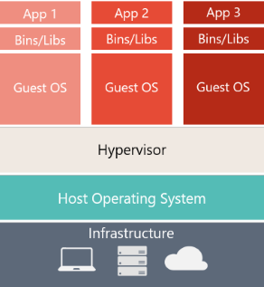

# 什么是Docker

Docker 是一种开源项目，用于将应用程序自动部署为可在云或本地运行的便携式独立容器。 Docker 也是一家公司，它与云、Linux 和 Windows 供应商（包括 Microsoft）协作，致力于推广和发展这项技术。


## Windows容器

有两种类型的运行时

||Windows Server|Hyper-V|
|--|--|--|
|**隔离类型**|通过进程和命名空间隔离技术来隔离|通过高度优化的虚拟机扩展Windows Server容器来提供隔离|
|**内核共享**|✓|✕|
|创建方式||[需要使用其他参数](https://learn.microsoft.com/zh-cn/virtualization/windowscontainers/manage-containers/hyperv-container)|

## 虚拟机和Docker容器

### 差别

||虚拟机|Docker容器|
|--|--|--|
|基础结构|✓|✓|
|主机操作系统|✓|✓|
|虚拟机监控程序|✓|✕|
|OS|每个VM一个|共享基础 OS 服务|
|依赖库|✓|✓|
|容器引擎|✕|✓|
|需要资源|多|少得多（**不需要一个完整的OS**）|
|图例|||

### Docker容器优缺点

1. 需要**资源更少**。
2. 使环境（依赖项）在不同的部署中**保持不变**
     可以在计算机上调试它，然后将其部署到保证具有相同环境的另一台计算机上。

     借助容器映像，打包应用和服务可采用可靠、可重现的方式进行部署。
3. 如在同一内核上，获得的隔离将比VM少

### 术语

#### 容器映像（Container image）

包含创建容器所需的所有依赖项和信息的包。
    1. 包含所有依赖项（如框架）
    2. 容器运行时使用的部署和执行配置
    contaniner image 派生自多个基础image（像堆叠在一起形成容器文件系统的层），创建后，image不可更改

#### Dockerfile

包含文本文件（用于说明有关如何生成Docker Image）。
类似于批处理脚本
    1. 第一行介绍基础image
    2. 然后安装所需程序，复制文件等操作的说明
    3. 直至获取所需的工作环境

#### Build

根据Dockerfile和上下文，生成image（以及文件夹中其他文件）的操作

```
    docker build
```

#### 容器（Container）

**Image的实例**，表示单个应用程序、进程或服务的执行。

由Image的内容、执行环境和一组标准指令组成。

 可以从同一Image创建多个容器， 并分别传递不同的参数。

#### 卷（Volumes）

提供一个容器可使用的可写文件系统

因为Image是只读的，但大多数程序都需要用到文件系统，所以Volumes在Image顶部添加了一个可写层，这样程序即可访问或写入文件系统，但程序并不知道访问的是分层文件系统，可当作平常用的文件系统。

Volumes位于主机系统种，由Docker管理。

#### Tag

可应用于Image的标记  

用来区分同一Image的不同image或版本，具体取决于版本号或目标环境  

#### 多阶段生成（Multi-stage Build）

可帮助减小最终映像的大小。 例如，包含 SDK 的大型基础映像可用于编译和发布，仅小型运行时基础映像可用于托管应用程序。

#### 存储库（Repository,repo）

 相关Docker images的集合，并带有指明image版本的标记。

有些存储库包含特定image的多个变量，比如包含SDK或者纯运行时的image，可以用tag标记。

#### 注册表（Registry）

提供访问存储库权限的服务。

大多数公共image的默认注册表是Dockers Hub。

通常包含来自多个团队的存储库。企业一般创建私有注册表来存储和管理iamges。

#### 多体系结构映像（Multi-arch image）

如果是多技术体系结构下，可根据运行Docker的所在平台简化选择适合image的过程。

例如：当 Dockerfile 从注册表中请求基础映像 FROM mcr.microsoft.com/dotnet/sdk:6.0 时，它会从 6.0-nanoserver-20H2、6.0-nanoserver-1809 或 6.0-bullseye-slim中选择一个获取，具体取决于运行 Docker 的操作系统和版本

#### Docker Hub

上传并使用image的公共注册表。

提供Docker image托管，注册表，构建触发器和web hooks，继承GitHub和Bitbucket

#### Docker受信任注册表(Docker Trusted Registry,DTR)

Docker注册表的服务，可以安装在本地，存在于组织的数据中心和网络中。

对于管理私有image来说会很方便，是Docker数据中心产品的一部分。

#### Docker Desktop

在Windows和MaxOs平台下，用于在本地生成、运行和测试容器的开发工具。

取代了基于Oracle VirtualBox 的 Docker Toolbox。

#### Compose

一种命令行工具和带有元数据的 YAML 文件格式，用于定义和运行多容器应用程序。

定义一个基于多image的应用程序包含单个或多个.yml文件，这些文件可以重写依赖于环境的值；之后可以使用命令（在Docker主机上为每个image创建容器）来部署整个多容器应用程序。

#### Cluster

Docker主机集合像单一虚拟Docker主机一样公开，这样可以扩展到服务分布在集群中多个主机的多个实例。

可以用Kubernetes、Azure Service Fabric、Docer Swarm和Mesosphere DC/OS创建。

#### 业务流程协调程序（Orchestrator）

简化集群和Docker主机管理的工具。

通过CLI或图形UI，能够管理其image，容器和主机。

可以管理容器网络、配置、负载均衡、服务发现、高可用性、Docker主机配置等。

负责跨界点集合运行、分发、缩放和修复工作负荷。

如Kubernetes， Azure Service Fabric。
