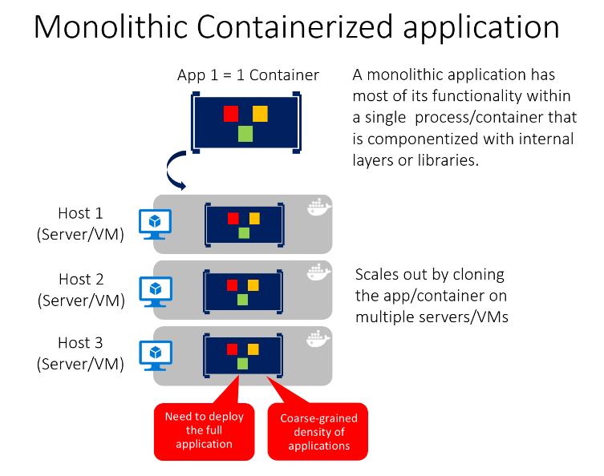
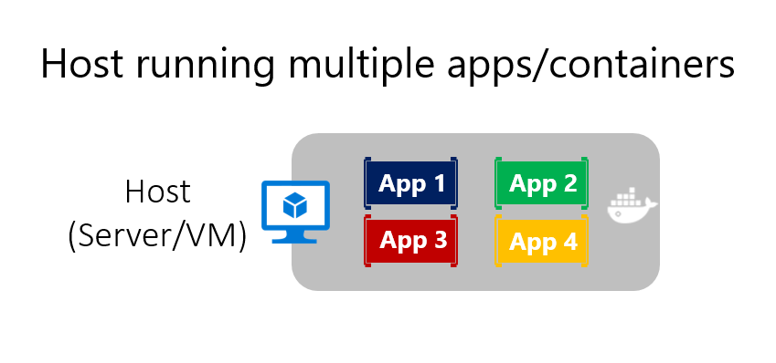
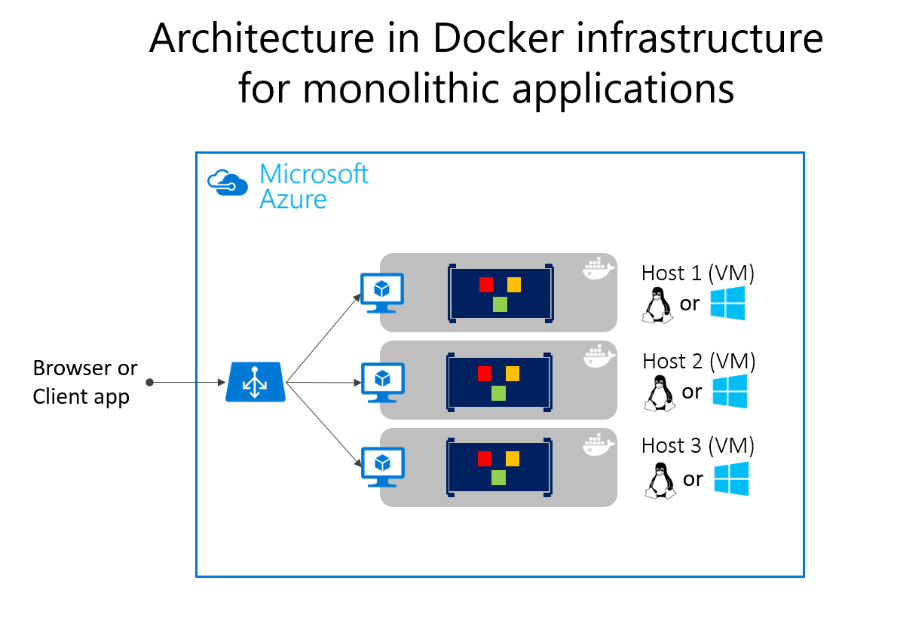

# 容器化整体式应用程序

## 什么是整体式应用程序

就是我们项目架构中最常见最经典的代码结构和部署方式（项目内部即使分层了，最终对外部署也是单个进程的）。

要管理此模型，直接用一个容器部署就可以了。
如果要增加容量，可进行横向扩展（复制多个该容器，并将负载均衡放置前面）。

或者这样

### 微软的Azure还能这样

部署多个Docker主机VM并使用Azure平衡器平衡这些VM，这样可以使用粗粒度的方法管理缩放。

因为整个应用程序都在单个容器中

## 横向扩展可能存在缺点

1. 违背了容器原则( 一个容器在一个进程中做一件事) ，但某些情况下也问题不大。
2. 只能全量扩展，大多数情况下，应用程序只有少数部分需要进行扩展，其他组件很少用到（如个人资料管理这种基本不需要扩展）。
3. 修改了单个组件后，还需要完全重新测试整个程序，并完全重新部署所有实例。

绝大多数应用程序都是这种，因为开发最初比微服务更容易。
也因为以前的工具和基础结构难以构建面向服务的架构（SOA），程序增长前也没发现这种需求。

## 容器化整体式应用程序的好处

1. 缩放容器实例比部署另外的VM要快得多，也容易得多。（Docker Image通常几秒内启动，拆除`docker stop`也很简单快速，一般一秒内便可完成）
2. 传统部署方式，管理应用程序的配置属于VM的一部分，这不是理想方式。
3. 容器设计为不可更改，所以不必担心损坏的VM。VM的更新脚本可能会忘记某些特定配置的账户和磁盘文件。
4. 可以使用Orchestrator进行部署，管理每个容器实例的各种实例和生命周期。
