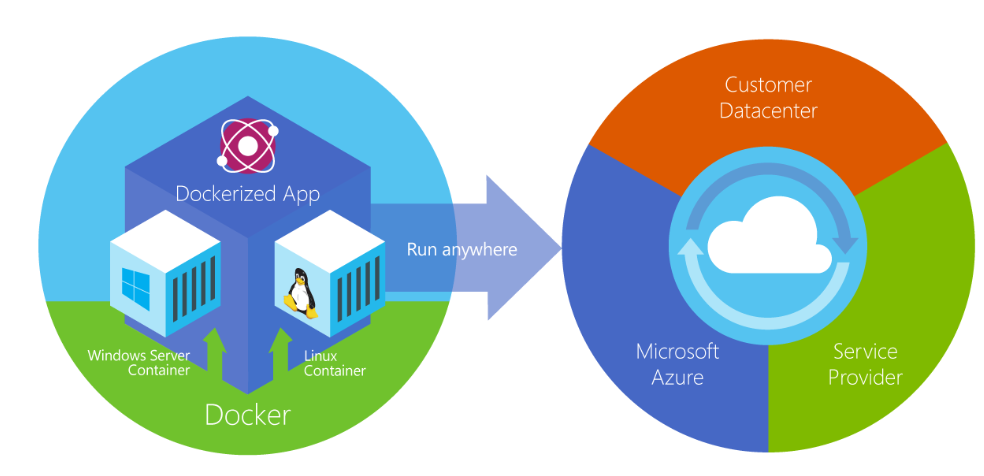
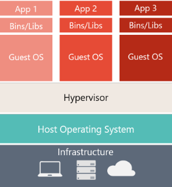
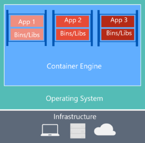

# 什么是Docker

Docker 是一种开源项目，用于将应用程序自动部署为可在云或本地运行的便携式独立容器。 Docker 也是一家公司，它与云、Linux 和 Windows 供应商（包括 Microsoft）协作，致力于推广和发展这项技术。



## Windows容器

有两种类型的运行时

||Windows Server|Hyper-V|
|--|--|--|
|**隔离类型**|通过进程和命名空间隔离技术来隔离|通过高度优化的虚拟机扩展Windows Server容器来提供隔离|
|**内核共享**|✓|✕|
|创建方式||[需要使用其他参数](https://learn.microsoft.com/zh-cn/virtualization/windowscontainers/manage-containers/hyperv-container)|

## 虚拟机和Docker容器

### 差别

||虚拟机|Docker容器|
|--|--|--|
|基础结构|✓|✓|
|主机操作系统|✓|✓|
|虚拟机监控程序|✓|✕|
|OS|每个VM一个|共享基础 OS 服务|
|依赖库|✓|✓|
|容器引擎|✕|✓|
|需要资源|多|少得多（**不需要一个完整的OS**）|
|图例|||

### Docker容器优缺点

1. 需要**资源更少**。
2. 使环境（依赖项）在不同的部署中**保持不变**
     可以在计算机上调试它，然后将其部署到保证具有相同环境的另一台计算机上。

     借助容器映像，打包应用和服务可采用可靠、可重现的方式进行部署。
3. 如在同一内核上，获得的隔离将比VM少

### 术语

#### 容器映像（Container image）

    包含创建容器所需的所有依赖项和信息的包。
    1. 包含所有依赖项（如框架）
    2. 容器运行时使用的部署和执行配置
    contaniner image 派生自多个基础image（像堆叠在一起形成容器文件系统的层），创建后，image不可更改

#### Dockerfile

    包含文本文件（用于说明有关如何生成Docker Image）。
    类似于批处理脚本
    1. 第一行介绍基础image
    2. 然后安装所需程序，复制文件等操作的说明
    3. 直至获取所需的工作环境

#### Build

    根据Dockerfile和上下文，生成image（以及文件夹中其他文件）的操作

```
    docker build
```

#### 容器（Container）

    Image的实例，表示单个应用程序、进程或服务的执行。
    
    由Image的内容、执行环境和一组标准指令组成。
    
    可以从同一Image创建多个容器， 并分别传递不同的参数。

#### 卷（Volumes）

    提供一个容器可使用的可写文件系统

    因为Image是只读的，但大多数程序都需要用到文件系统，所以Volumes在Image顶部添加了一个可写层，这样程序即可访问或写入文件系统，但程序并不知道访问的是分层文件系统，可当作平常用的文件系统。
    Volumes位于主机系统种，由Docker管理。

#### Tag

    可应用于Image的标记

    用来区分同一Image的不同image或版本，具体取决于版本号或目标环境

#### 多阶段生成（Multi-stage Build）

    可帮助减小最终映像的大小。 例如，包含 SDK 的大型基础映像可用于编译和发布，仅小型运行时基础映像可用于托管应用程序。

#### 存储库（Repository,repo）
