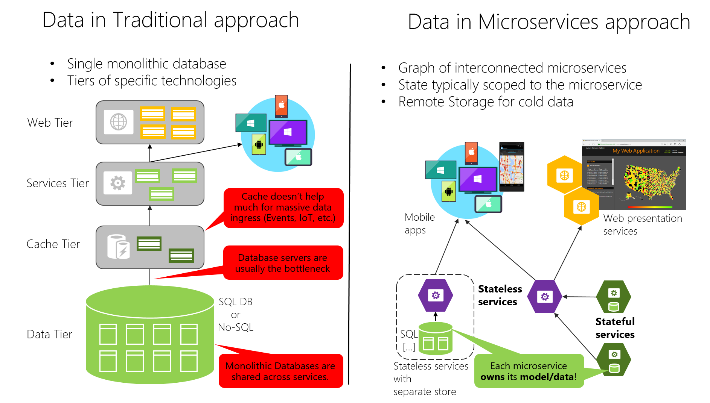

# 每个微服务的数据主权

## 微服务体系重要原则

**每个微服务必须拥有其域数据和逻辑**。就像一个完整的应用程序拥有其逻辑和数据一样，微服务也必须在其自治的生命周期内拥有其逻辑和数据，且每个微服务都必须独立部署。

比如： 客户管理系统、交易购买子系统和客户支持子系统，都各自调用唯一客户实体属性和数据，并采用不同的边界上下文（BC）。

### 微服务与边界上下文模式的关系

微服务概念源自于领域驱动设计DDD中的边界上下文(BC)模式。
DDD将大模型划分为多个BC并明确其边界来处理大型模型。
每个BC必须有自己的模型和数据库。
同样，每个微服务都拥有自己的相关数据，
微服务就像一个边界上下文，但它也制定了它是一个分布式服务。

微服务每个边界上下文或自治子系统或服务必须拥有其域模型（数据+逻辑+行为）。
每个DDD边界上下文对应一个业务微服务(1个或多个).

## 数据存储差异

### 传统方式

传统方式是采用单个集中式的数据库或极少量的数据库。
通常是用于整个应用程序及所有内部子系统的规范化Sql数据库

### 微服务

每个微服务都拥有自己的模型/数据

### 优劣分析

> 两种方式都有优劣，并不是说微服务就一定好于传统方法。
非必要不微服务化。

#### 传统方式

1. 看似会在不同子系统中重用实体，但最终会得到由很多不同子系统提供服务的一个**大型的表**，其中包括了很多情况下**用不到的属性和列**。
    就好比你去散步旅行，短期自驾游和学习地理知识，都用的同一个地图。
2. 所有服务共享一个数据库，并且通常采用分层体系架构。
3. ACID事务，可跨应用程序的进行工作。
4. SQL语句编写难度。连表查询用join即可轻松编写。

#### 微服务方式

1. 由于每个微服务的数据都专用于自己，要访问别域数据，只能通过其API终结点(REST,gRPC,SOAP等)进行同步访问，或者通过消息传递（AMQP等）进行异步访问，所以无法使用ACID。

> 当业务流程跨多个微服务时，**必须使用最终一致性**。这将比简单的slq连接更难实现，因为无法在不同数据库之间创建完整性约束或分布式事务。

不同的微服务通常使用不同类型的数据库，NoSql在某些场景比传统RDB更有优势。

2. 多语言的持久架构给数据存储带来了**松散耦合的服务**以及更好的**性能**，**可伸缩性**，**成本**和**可管理性**
