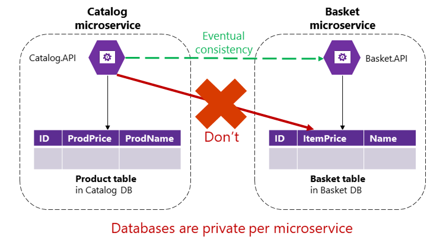

# 分布式数据管理的挑战和解决方案

## 挑战1：如何定义每个微服务的边界

首先关注应用进程的逻辑域模型和相关数据，尝试识别同一应用进程中分离的数据孤岛和不同上下文，每个上下文可能具有不同的业务语言(业务术语)
不同上下文中所用的术语和实体可能听起来相似，但在特定的上下文中，概念会不一样。比如用户在identity上下文中成为用户，在CRM上下文中成为客户，在购买上下文中成为购买者等。

详细点击此处[识别每个微服务的域模型边界](/docs/note/12_识别每个微服务的域模型边界/index.md)

## 挑战2：如何创建从多个微服务中检索数据的查询

由于数据是多个数据库保存的，当某个界面需要同时显示多个微服务的信息时，就需要从多个微服务中查询。如果要提高通信的效率，需要通过一些方法来聚合信息。

那么怎么聚合呢？

### api网关

如果是拥有不同数据库的多个微服务的简单数据聚合，建议使用Api网关的聚合微服务。
*需要小心该模式可能是系统的瓶颈，并且可能违反微服务自治原则，为了减少可能性，可以拥有**多个**细粒度的api网关，每个网关都专注于系统的垂直切片和业务区域*

### 具有查询/读取表的CQRS

如果是单个数据库，可以使用Sql查询 然后将多个表数据拉取到一起。但如果有多个数据库，并且每个数据库都属于不同微服务，就无法使用SQL查询了，此时复杂查询变成了一个挑战。
可以使用命令查询职责分离（CQRS）来解决。
在仅用于查询的不同数据库中创建非规范化表。
**具体化视图模式** 该方法可提前生成一个只读表，其中包含多个微服务所拥有的数据。
*不仅解决了跨服务查询和联表的问题，还显著提高了性能，因为查询表中已具有应用程序所需的数据。当然使用CQRS也意味着需要完成额外的开发工作，并且达成最终一致性*

[什么是CQRS？](https://learn.microsoft.com/zh-cn/azure/architecture/patterns/cqrs)

[什么是具体化视图模式？](https://learn.microsoft.com/zh-cn/azure/architecture/patterns/materialized-view)

### 中央数据库的“冷数据”

对于可能不需要实时数据的复杂报表和查询，一种常见的方法是将“热数据”（来自微服务的事务数据）作为“冷数据”导出到仅用于报表的大型数据库中。
该中央数据库系统可以是**基于大数据的系统**(如Hadoop)，**数据仓库**（如基于Azure SQL数据仓库的系统），甚至是**仅用于报告的单个SQL数据库**（如果大小不是问题）
> 请注意，该方法仅用于不需要实时数据的查询和报告。

同步数据的方法有两种：

1. 使用事件驱动的通信
2. 使用其他数据库基础结构导入/导出工具

## 挑战3：如何实现微服务之间的一致性

例举场景：
[示例源码](https://github.com/dotnet-architecture/eShopOnContainers)
目录微服务维护有关所有产品的信息，包括产品价格。
购物篮微服务管理有关用户添加到购物篮的产品项的时态数据，包括商品到购物篮时的价格。

当产品价格在目录更新时，该价格也应该在包含相同产品的活动购物篮中更新，并且系统告诉用户，说价格发生了变化。

如果只是单机版本，当价格发生变化时，目录子系统只需要使用ACID事务即可更新购物篮价格。
但是在微服务中，它俩位于各自的微服务，微服务不应在自己的事务中包含另一个微服务的表/存储，甚至于直接查询也不能包含。

要更新购物篮的价格，目录微服务应该**基于异步通信**（如集成事件）**使用最终一致性**。

如**CAP定理**所述，需要在可用性和ACID强一致性之间做选择。而大多数基于微服务的场景都**需要可用性和高扩展性，而不是强一致性**。
开发人员通过**弱一致性**或**最终一致性**的技术来解决强一致性问题。这是大多数微服务架构所采用的方法。

可以通过**事件驱动通信**和**发布订阅系统**在微服务之间使用达到**最终一致性**

另外，ACID和两阶段提交事务不仅违反微服务原则，大多数Nosql数据库并不支持分布式数据库方案中常见的两阶段提交事务。

> CAP原则又称CAP定理，指的是在一个分布式系统中，一致性（Consistency）、可用性（Availability）、分区容错性（Partition tolerance）。CAP 原则指的是，这三个要素最多只能同时实现两点，不可能三者兼顾。

## 挑战4：如何设计跨微服务边界的通信

这里的通信指的是微服务之间的通信，也就是进程间通信。
如何设计出解耦合的进程间通信，常用的同步调用肯定是不行的。

比如：购买微服务在一个请求周期内，转而http调用了库存微服务，这看起来好像合理，但暴露的问题也出来了：

1. **阻塞和低性能。**由于http的**同步性质**，在所有内部HTTP调用完成之前，原始请求不会得到响应，如果调用链数量大量增加，同时其中一些微服务的http调用被阻塞，那么结果必然是性能受到影响，并且随着数量增多，整体可伸缩性将指数级被影响。
2. **微服务与http耦合。** 业务微服务不应该依赖于其他微服务。理想状况下，两者之间应该是不知道对方存在的。如果产生了这种耦合，那么将不可能实现每个微服务的**自治**。
3. **任何微服务的失败影响。** 当其中某个微服务失败时，整个调用链也将失败。而基于微服务的系统应该设计为在部分微服务故障了也能尽可能的继续工作。*即使实现失败重试机制，在http调用链复杂的情况下，失败策略就越复杂*

如上，这样就跟一个整体程序没有什么区别了。为了强化微服务的自治和恢复能力，应该尽可能的减少使用跨微服务的请求/响应通信链。
建议仅使用异步交互进行微服务间通信。
方法是：**使用异步消息和基于事件的通信，或者独立于原始http请求周期的http轮询（异步）。**
我这就去了解怎么做->
