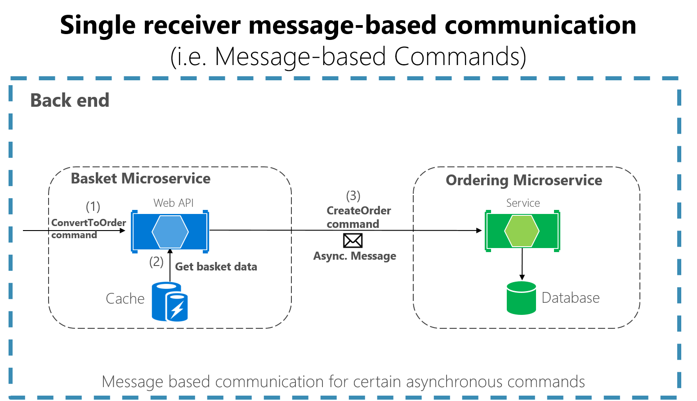
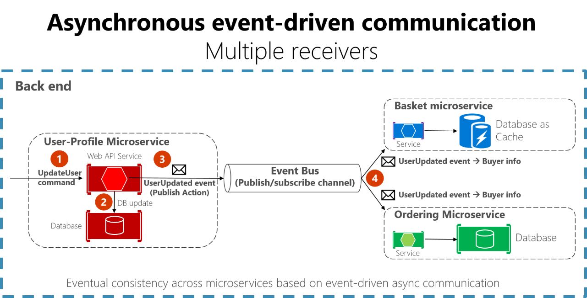

# 基于消息的异步通信🏅

> 在多个微服务及相关域模型中传播更改时，异步消息传递和事件驱动通信是至关重要的。

如前面所述，模型（*用户、客户，产品，账户等*）对于不同的微服务或BC可能有不同的含义。意味着当发生更改时，需要某种方法来协调不同模型之间的更改。
**解决方案是基于异步消息的最终一致性和事件驱动通信。**

消息传递跟同步的不同：*客户端通过向服务发送消息来作为命令或请求，如果服务需要回复，返回给客户端的不是同一次请求，而是另外一条不同的消息，因为基于消息的通信，客户端默认就不会立即收到回复，甚至可能就没回复*

?> 消息由标头header（*标识或安全信息等元数据*）和主体body组成，通常基于异步协议（*AMQP*）发送。

消息通信框架一般首选**轻型消息代理**，它与SOA中使用的大型代理和业务流程协调程序不同。

轻型消息代理，通常基础结构比较“笨”，只能充当消息代理，具有简单的实现。*如RabbitM和云可缩放服务总线(Azure服务总线。

## 另一个应该尽量遵循的规则

 仅在内部服务之间使用异步消息传递。

 仅从客户端应用到前端服务 *(api网关以及第一级微服务)* 使用同步通信 *(如Http)*。

## 两种异步消息通信

### 一、基于消息的单接收者通信

 意味着该异步通信存在**点对点通信**，
 即：仅向正在该通道读取数据的一个使用者消息，并且该消息只处理一次。
 *特殊情况：尝试从故障中自动恢复的云系统，可以多次发送相同的消息。或者由于网络或其他故障，客户端必须重试发送，服务器也必须实现幂等，以便于消息只能处理一次不会有多次生效的问题。*

**场景：**
单接收方基于消息的通信特别适合将异步命令从一个微服务发送到另一个微服务

!> 我们一旦开始使用基于消息的通信，就应该避免将基于消息的通信与同步http混合使用。

### 二、基于消息的多接收者通信

 这种是使用**发布/订阅机制**。使用时，可能会使用事件总线接口向任何订阅者发布事件。

---

## 事件驱动的异步通信

**使用条件：**
微服务在其域内发生了某些事情时发布集成事件，而另一个微服务需要知道该变化。
*如：产品目录微服务中的价格变化了，其他微服务需要订阅这些事件，以便于异步方式通知它们。*
发生时，订阅者可能会更新自己的域实体，可能又会发布更多的集成事件。

我们使用**事件总线的实现**来执行发布/订阅系统。
事件总线可以设计成包含API的抽象或接口，在**订阅、取消订阅，发布事件**时，需要使用该API。
事件总线还可以包含一个或多个基于任意进程间和消息传递代理的实现（*如支持异步消息通信和发布订阅的消息队列或服务总线*）。

**使用受集成事件驱动的最终一致性的影响：**
建议向终端用户明确告知该影响。而系统也不应该使用模拟集成事件的方法（*如客户的SignalR或轮询*）.
终端用户和业务所有者必须明确的接受系统中的最终一致性，并让他们意识到在许多情况下，合理使用该方法，业务就不会有任何问题。
> 这个很重要，因为用户可能希望立即看到一些结果，但在使用最终一致性时，可能无法实现这一点。

就像前面说的，可以使用集成事件来实现跨多个微服务的业务任务，这些服务之间将具有最终一致性。
最终一致事务由一组分布式操作组成。
在每个操作中，相关的微服务都会更新一个域实体，并发布另一个集成事件，该事件在同一个端到端业务任务中引发下一个操作。

在与订阅了同一事件的多个微服务通信时，可以使用基于事件驱动通信的发布订阅消息传递（*这种机制并不是微服务体系独有，类似于DDD中边界上下文的通信方式，或者类似于命令查询责任分离模式（CQRS）中将更新从写入数据库传播到查询数据库的方式*）。**目的是在分布式系统中的多个数据源之间实现最终一致性**

一个微服务将事件发布到事件总线，许多微服务可以订阅它，以获取通知并对其操作。
你的实施将决定使用什么协议进行事件驱动的、基于消息的通信。 AMQP可以帮助实现可靠的排队通信。

使用事件总线时，可能需要使用基于相关实现的抽象级别（如事件总线接口），这些实现在类中使用来自消息代理（如 RabbitMQ）或服务总线（如Azure 服务总线）的代码。或者，你可能希望使用更高级别的服务总线（如 NServiceBus、MassTransit 或 Brighter）来阐明事件总线和发布/订阅系统

---

## 生产环境使用消息传递技术的说明

当在生产环境使用时：
可用于实现抽象事件总线的消息传递技术有着不同的级别。

 *例如，像RabbitMQ（消息传递代理传输）和Azure服务总线这样的产品比NServiceBus，MassTransit或Brighter等其他产品的级别低，这些产品可以在RabbitMQ和Azure Service Bus之上工作。你的选择取决于应用进程级别**需要多少丰富的功能以及应用进程所需的开箱即用的可伸缩性**。为了仅为开发环境实现概念证明事件总线，就像在 eShopOnContainers 示例中所做的那样，在 Docker 容器上运行的 RabbitMQ 之上的简单实现可能就足够了。*

 ---

## 弹性的发布到事件总线

 跨多个微服务实现事件驱动架构时的一个挑战是：
 **如何以原子方式更新原始微服务中的状态，同时将其相关集成事件弹性地发布到事件总线中（在某种程度上基于事务）？**
 以下是实现此功能的几种方法，当然也可能有其他方法：

1. 使用事务（基于 DTC）队列，如 MSMQ。 （不过，这是一种传统方法。）
2. 使用事务日志挖掘。
3. 使用完整事件溯源模式。
4. 使用发件箱模式：将事务数据库表作为消息队列，该队列将成为事件创建者组件的基础，该组件将创建事件并发布事件。

有关此领域中挑战的更完整描述，包括最终如何发布具有潜在错误数据的消息，请参阅[Azure 上任务关键型工作负载的数据平台：必须处理每条消息。](https://learn.microsoft.com/zh-cn/azure/architecture/reference-architectures/containers/aks-mission-critical/mission-critical-data-platform#every-message-must-be-processed)

还有需要考虑的**消息幂等性和重复消息删除**，将在后续介绍。
