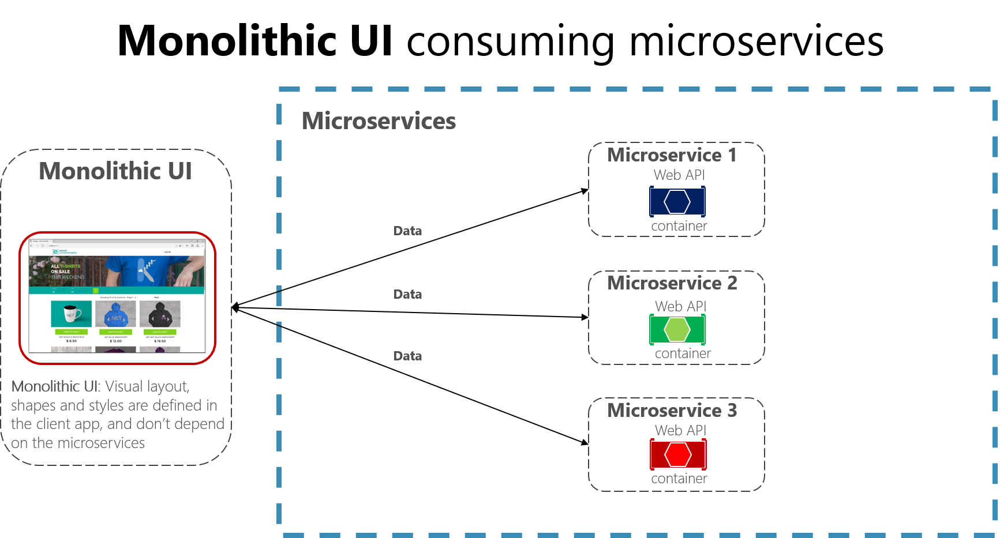
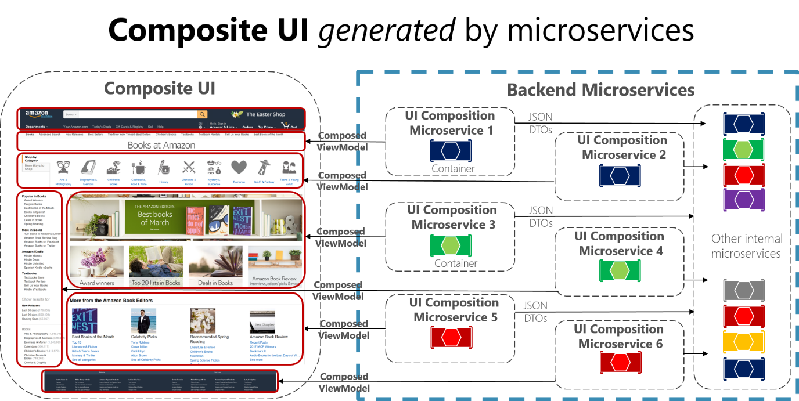

# 创建基于微服务的复合 UI

> 微服务架构通常用于在服务端处理数据和逻辑，很多情况下，UI方面仍然是作为整体来设计的。
> 但是一种叫“[微前端](https://martinfowler.com/articles/micro-frontends.html)”的更高级的方法也是根据微服务设计的应用程序UI。
> 意味着这样拥有的是由微服务生成的复合UI，而不是服务器上的微服务和使用微服务的整体客户端应用。

下图展示的就是整体式UI使用微服务的简单方式。

 跟这种方式相比，复合UI是由微服务本身精确生成和组合成的。
某些微服务驱动 UI 特定区域的视觉形状。
*主要区别在于，你具有基于模板的客户端 UI 组件（例如 TypeScript 类），并且这些模板的数据构形 UI ViewModel 来自每个微服务。*

 客户端应用程序启动时，每个客户端UI组件（如 TypeScript 类）自身都会注册一个基础结构微服务。该微服务能够为特定方案提供ViewModel。如果微服务数据发生改变，则UI也会更改。

 下图展示了复合UI的一个简化示例。
 *因为我们可能还有其他微服务聚合基于不同技术的粒度部分。这取决于构建传统的Web方法（ASP.NET MVC）还是SPA（单页应用进程）。*

 

这些UI组合微服务中的每一个都类似于一个小型的API网关。只是在这种情况下，每个服务都负责一个小的UI领域。

> 由微服务驱动的复合UI方法的难度可能更大也可能更小，具体取决于使用的UI技术。
> 例如：生成传统的web应用程序时，不会采用SPA或本机原生开发(*如开发Xamarin应用时，这种方法难度会比较大*)

示例采用的是整体式UI方法，原因是不宜一次性整太复杂。

下方为深入了解微前端资料
[微前端 - Martin Fowler 的博客](https://martinfowler.com/articles/micro-frontends.html)

[微前端 - Michael Geers 站点](https://micro-frontends.org/)

[使用 ASP.NET（Particular 的 Workshop）的复合 UI](https://github.com/Particular/Workshop/tree/master/demos/asp-net-core)

[在微服务体系结构中管理前端](https://allegro.tech/2016/03/Managing-Frontend-in-the-microservices-architecture.html)
