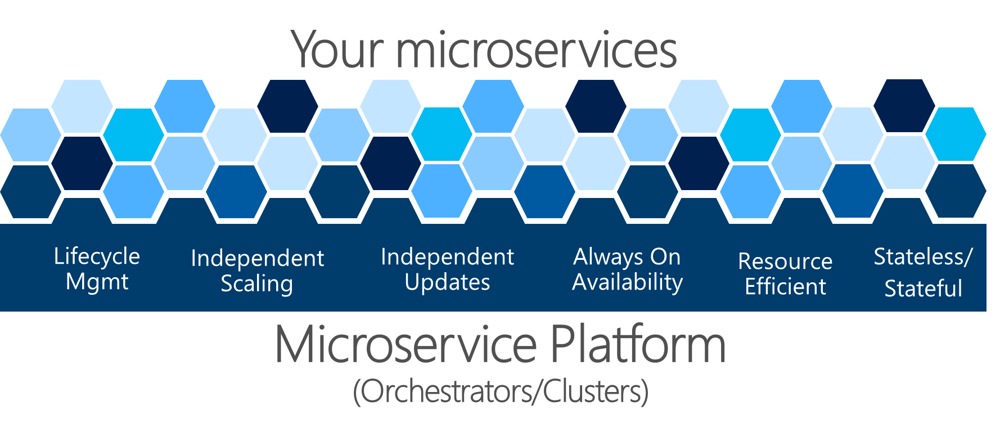

# 微服务中的复原和高可用性

> 处理意外故障是最难解决的问题之一。
> 尤其在分布式系统中，开发编写的大部分代码都涉及异常处理，这也是在测试上花费最多时间的地方。

运行微服务的故障会发生什么情况？ 不仅需要检测这个微服务的故障，还需要一些手段来重启微服务。

## 微服务需要怎么样的复原能力呢？

当在A计算机故障时，能在B计算机上重新启动。
这种复原能力需要微服务故障时保存状态，并在重启时恢复保存的状态，并且要能成功启动。
**总的来说就是进程随时可以重新启动，并且不会丢失数据并且数据保持一致**

当然我们可能还需要面对更复杂的情况。
*如当升级应用程序时，发生故障，其他关联微服务需要确定是中断发布，还是继续更新到新版本。这个时候需要考虑的是：是否有足够的机器能够继续更新，以及如何恢复以前版本的微服务等等问题。这种方法需要微服务发出运行状况信息，以便于整个应用程序和业务流程协调程序可以做出这些决定。*

 复原也与基于云的系统的必要行为有关。
基于云的系统必须接受故障发生的必然性，并且必须尝试自动从故障中恢复。*如：在网络或容器发生故障时，客户端应用进程或客户端服务必须具有 重试发送消息或请求的策略。因为许多情况下，云的故障是部分故障*
云中故障可通过使用库(如[Polly](https://github.com/App-vNext/Polly))又或者非代码的方式用[Linkerd 网格](https://linkerd.io/)来处理。

---

## 微服务中的运行状况管理和诊断

微服务必须报告其运行状况和诊断，如果被忽视，在运营角度来看，将没有洞察力。
*将诊断事件关联到一组独立的服务中，并且还要处理计算机的时间偏差问题来了解事件发生顺序是很有难度的。*

需要一个标准方式来记录运行状况和诊断事件，最终记录到事件存储中供查询和查看。

在微服务方法中，不同团队就单一日志记录格式达成一致至关重要。需要有一种一致的方法来查看应用进程中的诊断事件。

### 运行状况检查

运行状况不同于诊断 。运行状况是为了便于采取好的措施而需要微服务报告其当前状态。对微服务做出明智的决策，也是这有助于创建自我修复的微服务。

asp.net core内置了运行状况检查功能[Microsoft.Extensions.Diagnostics.HealthChecks](https://www.nuget.org/packages/Microsoft.Extensions.Diagnostics.HealthChecks)，后续会有讲解。

也有出色的开源库[AspNetCore.Diagnostics.HealthChecks](https://www.nuget.org/packages/Microsoft.AspNetCore.Diagnostics.HealthChecks/)供选择。*可以检查微服务是否处于活动状态和微服务的依赖项是否就绪。*

### 使用诊断和日志事件流

日志提供有关应用进程或服务运行方式的信息，包括异常、警告和简单的信息性消息。*通常，每个日志采用文本格式，每个事件一行，尽管异常也经常显示跨多行的堆栈跟踪。*

在基于服务器的整体式应用进程中，可以将日志写入磁盘上的文档（日志文档），然后使用任何工具对其进行分析。由于应用进程执行仅限于固定服务器或 VM，因此分析事件流通常不会太复杂。但是，**在跨业务流程协调进程群集中的多个节点执行多个服务的分布式应用进程中，能够关联分布式事件以便于收集日志是一项挑战**

基于微服务的应用进程不应尝试单独存储事件或日志文档的输出流，甚至不应尝试管理事件到中心位置的路由。**它应该是透明的，这意味着每个进程都应该将其事件流写入标准输出，该输出下将由运行它的执行环境基础结构收集。**
*这些事件流路由器的一个示例是 Microsoft.Diagnostic.EventFlow，它从多个源收集事件流并将其发布到输出系统。这些可以包括开发环境或云系统（如 Azure Monitor 和 Azure 诊断）的简单标准输出。还有一些很好的第三方日志分析平台和工具可以搜索、警报、报告和监控日志，甚至可以实时搜索，比如 Splunk。*

## 管理运行状况和诊断信息的业务流程协调程序

> 创建基于微服务的应用进程时，需要处理复杂性。当然，单个微服务处理起来很简单，但几十种或几百种类型和数千个微服务实例是一个复杂的问题。
> 这不仅仅是构建微服务架构，如果打算拥有一个稳定且有凝聚力的系统，还需要高可用性、可寻址性、复原能力、运行状况和诊断。

如上图所示，微服务平台的复杂问题很难自行解决。
而开发团队不应该在这种基础结构问题上花费精力，否则将耗费巨大成本。把精力用到解决商业问题和开发上。
所以，出现了面向微服务的平台(业务流程协调程序或微服务集群)，它们**试图解决构建和运行服务以及高效使用基础结构资源的难题。** 此方法降低了构建使用微服务方法的应用进程的复杂性。
*不同的业务流程协调程序在诊断和健康检查的功能和成熟度状态方面有所不同，又是取决与OS平台。*
