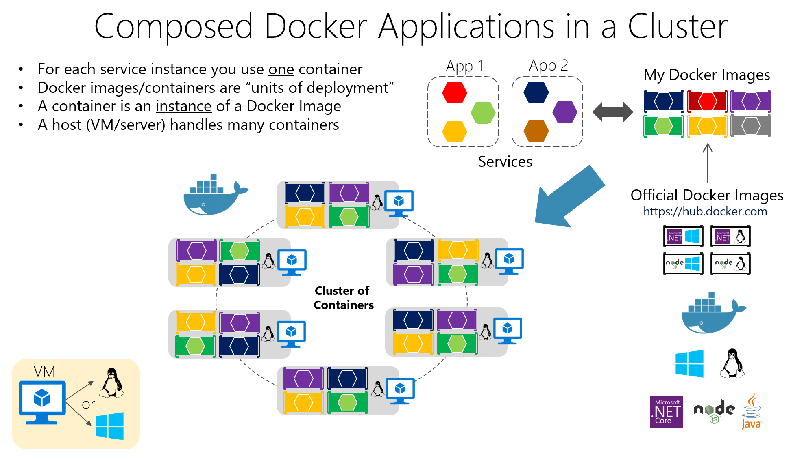
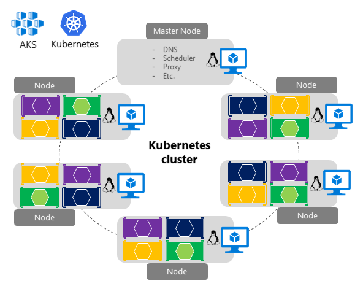
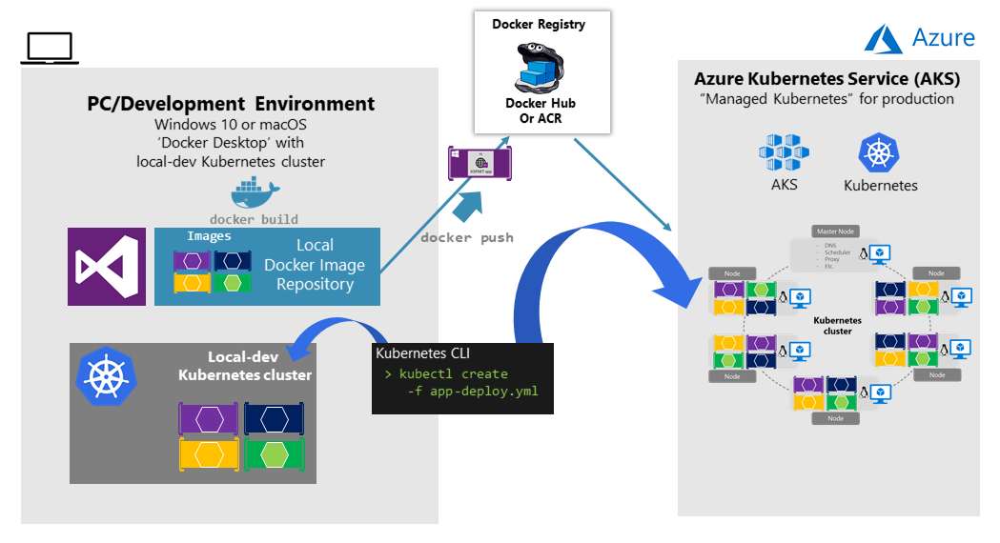

# 编排微服务和多容器应用进程，以实现高可扩展性和可用性

 如果应用进程基于微服务或只是跨多个容器拆分，则必须将业务流程协调进程用于生产就绪应用进程。

如前所述，在基于微服务的方法中，每个微服务都拥有其模型和数据，因此从开发和部署的角度来看，它将是自治的。
但是，即使有一个由多个服务（如 SOA）组成的更传统的应用进程，也将拥有多个容器或服务，其中包含需要部署为分布式系统的单个业务应用进程。

**这些类型的系统扩展和管理起来很复杂;因此，如果要拥有一个生产就绪且可缩放的多容器应用进程，就绝对需要一个业务流程协调程序。**

下图展示了如何部署到由多个微服务（容器）组成的应用程序群集。

为每个服务实例使用一个容器。Docker 容器是“部署单元”，容器是 Docker 的实例。主机处理许多容器。这似乎是一种合乎逻辑的方法。
但是，如何处理负载均衡、路由和编排这些组合应用进程呢？

单个 Docker 主机中的普通 Docker 引擎满足在一个主机上管理单个image实例的需求，但在管理部署在多个主机上的多个容器以用于更复杂的分布式应用进程时，它就不足了。**在大多数情况下，需要一个管理平台，该平台将自动启动容器，横向扩展每个映像具有多个实例的容器，在需要时挂起或关闭它们，理想情况下还可以控制它们访问网络和数据存储等资源的方式。**

若要超越单个容器或简单组合应用的管理，转向具有微服务的大型企业应用程序，必须转向编排和群集平台。

## 支持大型应用的两套功能

 **群集和业务流程协调程序**
 当需要跨多个 Docker 主机扩展应用进程时，例如基于大型微服务的应用进程，**通过抽象底层平台的复杂性，能够将所有这些主机作为单个集群进行管理**是至关重要的。这就是容器群集和业务流程协调程序提供的。 *Kubernetes 是业务流程协调程序的一个示例，可通过 Azure Kubernetes 服务在 Azure 中使用。*

 **调度程序**
 计划意味着管理员能够在群集中启动容器，因此这些容器也可提供 UI。 群集计划程序具有多个职责：**高效使用群集资源、设置用户提供的约束、有效负载均衡节点或主机间的容器，以及在提供高可用性的同时强力解决错误。**

## 适用于容器群集、业务流程和计划的软件平台

|平台|说明|
|--|--|
|Kubernetes|Kubernetes 是一款开源产品，提供各种功能，从群集基础结构和容器计划到安排功能均涵盖在内。 它**能实现跨主机群集自动部署、缩放以及执行各种应用程序容器操作**。Kubernetes 提供以容器为中心的基础结构，将应用程序容器分组为逻辑单元，以便管理和发现。*Kubernetes 在 Linux 中的运用已发展成熟，但在 Windows 中相对较弱。*|
|Azure Kubernetes 服务 (AKS)|[AKS](https://azure.microsoft.com/zh-cn/products/kubernetes-service/) 是 Azure 中的托管 Kubernetes 容器业务流程服务，简化了 Kubernetes 群集的管理、部署和操作。（*说是不收费*）|
|Azure Container Apps|[Azure 容器应用](https://azure.microsoft.com/zh-cn/products/container-apps/)是一种托管的无服务器容器服务，用于大规模构建和部署新式应用。|

可以看到 Kubernetes 集群的结构，其中主节点 （VM） 控制集群的大部分协调，可以将容器部署到其余节点，从应用进程的角度来看，这些节点作为单个池进行管理，并允许扩展到数千甚至数万个容器。

## Kubernetes 的开发环境

> 在开发环境中，Docker 在 2018 年 7 月宣布，Kubernetes 也可以通过安装 Docker Desktop 在单个开发机器（Windows 10 或 macOS）中运行。稍后可以部署到云 （AKS） 进行进一步的集成测试

如下图所示：

## 使用 Helm chart 部署到 Kubernetes 群集

将应用进程部署到 Kubernetes 集群时，可以使用原始的 kubectl.exe CLI 工具，使用基于本机格式（.yaml 文档）的部署文档，如上一节所述。但是，对于更复杂的 Kubernetes 应用进程，例如在部署复杂的基于微服务的应用进程时，建议使用 [**Helm**](https://helm.sh/)。

**Helm Charts 可帮助定义、版本控制、安装、共享、升级或回滚最复杂的 Kubernetes 应用进程。**
*Azure 中的其他 Kubernetes 环境（如 Azure Dev Spaces）也基于 Helm 图表。*

> Helm 由云原生计算基金会 （CNCF） 维护，与 Microsoft、Google、Bitnami 和 Helm 贡献者社区合作。
