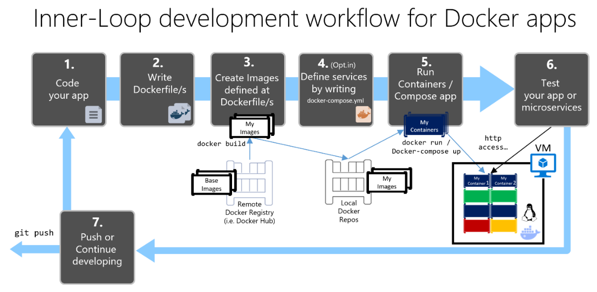

# 开发基于 Docker 容器的应用程序的工作流(非关键理论知识，瞎记)

  主要讲述基于 Docker 容器的内部循环工作流。
  内部循环工作流是指不考虑更广泛的 DevOps 工作流（最多可以包括生产部署），只关注在开发人员的计算机上进行的开发工作。其中不包括设置环境的初始步骤，因为这些步骤只需进行一次。


## 步骤 1 ：开始编码并创建初始应用程序或服务基线

开发Docker程序跟寻常程序方式类似，区别只是本地运行环境的差异。
即使是普通应用，也可以在docker中进行部署和测试。
当然能尽快使用最好，这样能尽早发现问题。

## 步骤 2 ：创建与现有 .NET 基础映像相关的 Dockerfile

要为每个项目生成的自定义image，需要提供一个`dockerfile`。
将 Dockerfile 放在应用程序或服务的根文件夹中。 Dockerfile 包含多个命令，**可指示 Docker 如何在容器中设置和运行应用程序或服务**。
*开发人员可在代码中手动创建 Dockerfile，并将其与 .NET 依赖项一起添加到项目中。也可以在项目中右键添加Docker支持*

### 使用多体系结构映像存储库

### Dockerfile 中的多阶段生成

Dockerfile 类似于批处理脚本
执行每个命令行都会在文件系统上创建新的层，其中包含对上一个层的更改，这样一来，合并时可以生成相应的文件系统。
> 由于每个新的层都位于上一层之上，并且随着每个命令的执行，生成的image大小也会增加，因此如果必须添加生成和发布应用程序所需的 SDK，那么image可能会变得非常大。所以就有了多阶段生成的需求。

**核心理念：可以将 `Dockerfile` 执行过程分为几个阶段，其中一个阶段为初始image，后续阶段是一个或多个命令，最后阶段确定最终的image大小。**

初始 Dockerfile 可能如下所示：

```docker
  #使用“小型”仅运行时基础映像开始一个阶段，将其称为“基础”，以供参考 。
  FROM mcr.microsoft.com/dotnet/aspnet:6.0 AS base
  WORKDIR /app #在映像中创建 /app 目录 。
  EXPOSE 80  #公开端口 80 。
  #使用“大型”映像开始用于生成/发布的新阶段。 将其称为“生成” ，以供参考。
  FROM mcr.microsoft.com/dotnet/sdk:6.0 AS build
  #在映像中创建目录 /src 
  WORKDIR /src 
  COPY src/Services/Catalog/Catalog.API/Catalog.API.csproj …
  COPY src/BuildingBlocks/HealthChecks/src/Microsoft.AspNetCore.HealthChecks …
  COPY src/BuildingBlocks/HealthChecks/src/Microsoft.Extensions.HealthChecks …
  COPY src/BuildingBlocks/EventBus/IntegrationEventLogEF/ …
  COPY src/BuildingBlocks/EventBus/EventBus/EventBus.csproj …
  COPY src/BuildingBlocks/EventBus/EventBusRabbitMQ/EventBusRabbitMQ.csproj …
  COPY src/BuildingBlocks/EventBus/EventBusServiceBus/EventBusServiceBus.csproj …
  COPY src/BuildingBlocks/WebHostCustomization/WebHost.Customization …
  COPY src/BuildingBlocks/HealthChecks/src/Microsoft.Extensions …
  COPY src/BuildingBlocks/HealthChecks/src/Microsoft.Extensions …
  #直到上面这行，复制引用的.csproj项目文件以便以后能够恢复包

  #还原 Catalog.API 项目和引用项目的包 。
  RUN dotnet restore src/Services/Catalog/Catalog.API/Catalog.API.csproj
  #将解决方案的所有目录树（.dockerignore 文件中包含的文件/目录除外）复制到映像中的 /src 目录 。
  COPY . .
  #将当前文件夹更改为 Catalog.API 项目 。
  WORKDIR /src/src/Services/Catalog/Catalog.API
  #构建项目（和其他项目依赖项）并输出到映像中的/app目录。
  RUN dotnet build Catalog.API.csproj -c Release -o /app
  #开始一个从构建继续的新阶段。称之为发布以供参考。
  FROM build AS publish
  #发布项目（和依赖项）并输出到镜像中的/app目录
  RUN dotnet publish Catalog.API.csproj -c Release -o /app
  #开始一个从base继续的新阶段，并将其称为final
  FROM base AS final
  #将当前目录更改为/app
  WORKDIR /app
  #将/app目录从发布阶段复制到当前目录
  COPY --from=publish /app .
  #定义容器启动时要运行的命令
  ENTRYPOINT ["dotnet", "Catalog.API.dll"]
```
