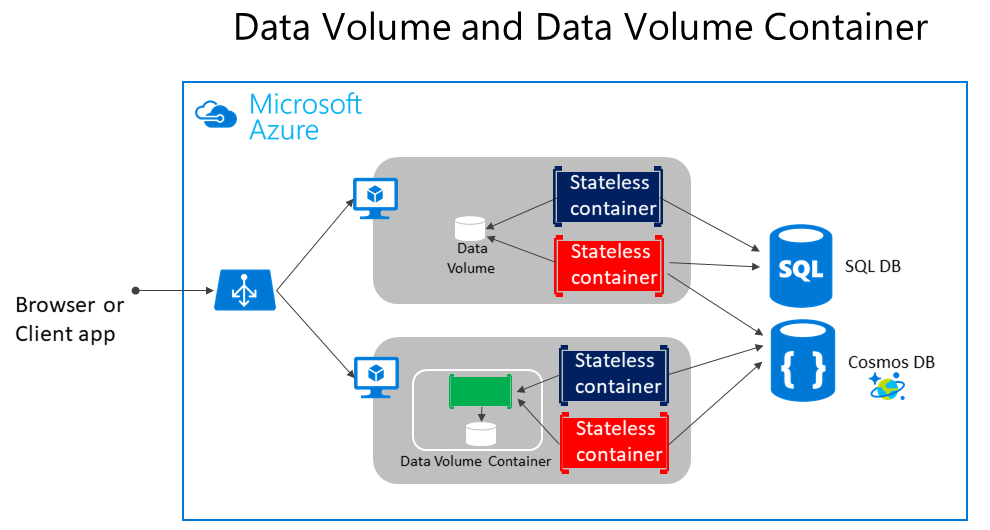

# Docker应用程序中的状态和数据管理

由于大多数情况下，容器都可以看作是进程的实例。进程并不维护持久状态，所以即使容纳其可以写入它自己本地存储，但这不现实，内存中的最终预期都是会被回收。
如果使用Orchestrator进行持续管理，也就像是从一个节点或VM移动到了另一个节点或VM上。

## 管理Docker应用程序中数据的解放方案

### 一、 在Docker主机中，以Docker Volumes的方式实现

 1. **Volumes**存储在由Docker管理的主机文件系统区域中。
 2. **Bind mounts** 允许建立docker容器中的文件与本地文件(任何文件夹)之间的映射关系。
   Docker进程写入这个文件的内容会保存到映射的本地文件中，不受Docker统一管理，并且访问会带来安全风险（容器可访问OS中的敏感文件夹），限制比Volumnes的限制还多
 3. **tmpfs mounts** 就像仅存在于主机内存中的虚拟文件夹，并且绝不会写入文件系统
   快速且安全，但使用内存，仅适用于临时的非持久性数据。

### 二、从远程存储实现

1. **远程关系数据库**(阿里云Mysql)、**NoSql**数据库(Azure Cosmos DB)，**缓存服务**（Redis）
2. Azure存储 提供可异地分发存储，为容器提供良好的持久性解决方案

### 三、从Docker容器实现

1. **覆盖文件系统（Overlay File System）**   该docke功能实现了写入时复制任务，该任务将更新后的信息存储到容器的根文件系统中。
饿  
信息基于容器的原始image，如果删除容器，更改则丢失。故虽可以在本地存储中保存容器的状态，但该设计与容器设计的前提冲突，容器设计默认情况下应该时无状态的。

### 首选Docker Volumes作为处理Docker中本地数据

Volumes是主机OS映射到容器目录的目录。
当容器中代码访问该目录时，实际访问的是对主机操作系统上的一个目录的访问。
该目录不与容器自身的生命周期绑定，且该目录由Docker管理并独立于主机计算机的核心功能。

所以，数据volumes用于将独立于容器生命周期的数据做持久化保存，删除容器或image并不会删除数据volumes中保留的数据。

Volumes可以被命名，也可继续保持匿名。
命名Volumes是Data Volumes Containers的演变，使得在不同容器之间共享数据变得容易。
Volumes还支持卷驱动程序，使得可将数据存储到远程主机上等。

#### 为什么仅用来处理本地数据？

常规Volumes可以存储在容器之外，主机服务器/VM的物理边界之内。
所以，容器无法从一个主机服务器/vm访问另一个主机服务器/vm的volume，数据无法共享，只能做本地数据。
因此，不建议将data volumes用于业务数据，但是可以用来处理跟踪文件、时态文件或类似的不会影响业务数据一致性的文件。

### 选择远程数据源/缓存作为存储业务数据的有效方法

1. 对象存储
   用于存储非结构化对象和数据，可以是任何类型的文本/二进制数据，如文档，图像，音视频等。
2. 数据库存储
    如Sqlserver，postgreSql,MongoDb,Redis等。
