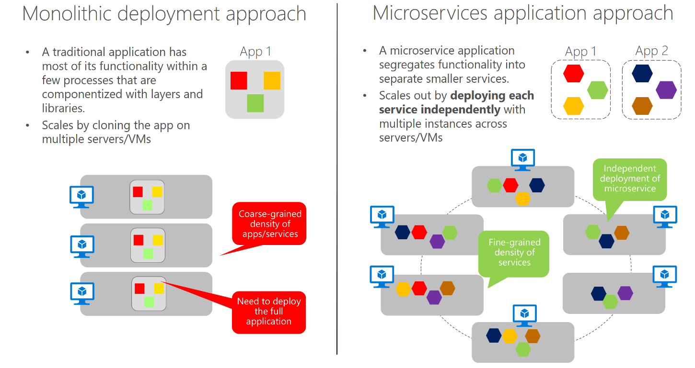

# Microservices architecture

一种将服务器应用程序构建成**一组小型服务**的方法。

1. 每个服务都在自己的进程中通信，使用HTTP/HTTPS、WebSockets或AMQP等协议与其他进程进行通信。

2. 每个微服务都在特定的上下文边界内实现特定的端到端域或业务功能。

3. 每个微服务都必须自主开发并可独立部署。

4. 每个微服务都应该拥有自己的相关域数据模型和域逻辑，并且可以基于不同的数据存储技术（SQL，NoSQL）和不同的编程语言(C#,Java).

## 设计方向

1. 内部内聚，独立于其他服务，以便自主的为每个服务进行开发、部署和缩放。
2. 在不与其他微服务存在过多的直接依赖项时，应该尽可能地小。

## 优势

1. 提供了长期的**灵活性**。
   微服务允许您基于许多可独立部署的服务创建应用进程，每个服务都具有精细和自治的生命周期，从而在复杂、大型和高度可扩展的系统中实现更好的可维护性。
2. 可以**独立横向扩展**。
   可以扩展特定的微服务，不像整体应用程序那样只能整体扩展（如下图）。这样需要的硬件更少，节省了成本。

> 在传统的整体式方法中，应用进程通过在多个服务器/vm中克隆整个应用来进行缩放。而微服务体系中，功能在较小的服务器中隔离，因此每个服务都可以独立缩放，并且允许对每个微服务 进行敏捷更改和快速迭代（因为可以更改复杂大型可缩放应用进程中的特定小区域）。

3. 基于微服务细粒度构建的应用程序，使**持续集成和持续交付在实践上具备可行性**。同时加快了新功能的交付

> 基于细粒度，还支持以隔离方式运行和测试微服务，并在维护明确契约的同时进行自主升级。
> 只要不更改接口或协定，就可以更改任何微服务的内部实现或添加新功能，而不会破坏其他微服务。

## 投入生产需要主要的方面

1. 对服务和基础结构的监视和运行状况检查

2. 服务(云和Orchestrator)的可缩放基础结构

3. 多层次的安全设计和实施：身份验证、授权、机密管理，安全通信等

4. 快速应用程序交付，一般不同的团队重点负责不同的微服务

5. DevOps和CI/CD实践和基础结构
