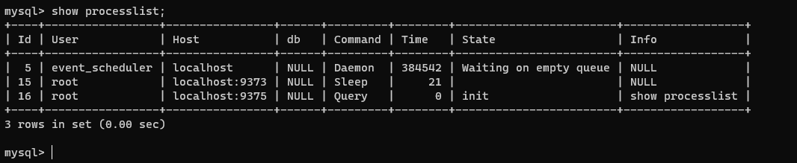

# 基础架构 一条SQL查询语句是如何执行的？

``` sql
    select * from T Where Id = 10;
```

当我们看到这样一条sql语句执行时，应该不应该只看返回结果，还应该更深入的了解，从下图基本架构图看看到各模块执行过程。


总的来说，mysql可以分为server层和存储引擎两部分。

**Server层**有：

1. 连接器
2. 查询缓存
3. 分析器
4. 优化器
5. 执行器
6. ...

> 涵盖了Mysql的大多数核心服务功能，以及所有的内置函数 *(日期，时间，数学和加密函数等)*
> 所有跨存储引擎的功能都在这一层实现。*比如存储过程、触发器、视图等*

**存储引擎层**负责数据的存储和提取。
其架构模式是插件式的，支持**InnoDB，MyISAM，Memory**等多个存储引擎。
最常用的InnoDB,在Mysql5.5.5开始成为默认存储引擎

也就是在创建表的时候，如果不指定引擎，默认就是InnoDB。但是可以在`create table`语句中使用`engine=memory`来指定内存引擎来创建表。
不同存储引擎的表数据存取方式不同，支持的功能也不同。

不同的存储引擎都共用一个Server层。

## Server层详解

### 连接器

语句最开始就是先连接数据库的连接器。

**连接器负责跟客户端建立连接、获取权限、维持和管理连接。**
连接命令一般这么写：

``` sql
    mysql -h$ip -P$port -u$user -p
```

输入完后，需要在下一步输入密码。
虽然密码也可以跟在`-p`后面写在命令行中，但这样可能会导致密码泄露。**生产环境中，强烈建议不要这样。**

连接命令中的`mysql`是客户端工具，用来跟服务端建立连接。
在完成经典的TCP握手之后，连接器就要开始认证身份了，这个时候用的就是刚刚输入的账户密码。

- 如果账户密码不对，会返回`Access denied for user`的错误，然后客户端程序结束执行。
- 如果通过，连接器会到权限表里查出账号拥有的所有权限。之后这个连接里的权限判断逻辑，都会依赖此时读取到的权限。

> 意味着 一个用户成功建立连接后，即时用管理员账号对这个用户权限做了调整，也不会影响已经存在的连接。只有修改后重新建立的才会应用新的权限设置。

连接完成后，如果没有后续动作，那么这个连接就处于空闲状态，可以在`show processlist`命令中看到它。这里我们开两个窗口，一个只登录成功，另一个登录成功执行命令查询。就会如下所示：



`sleep`的那条就是只登录不操作的。表示空闲连接。

如果客户端长时间没有动静，连接器就会自动将它断开。时间由参数`wait-timeout`控制，默认8小时。

如果被断开后客户端再次发送请求，就会收到错误提醒：`Lost connection to MySQL server during query`。继续的话，就需要重连，然后再执行请求。

`长连接` 在连接成功后，如果客户端持续有请求，则一直使用同一连接。
`短连接` 每次执行完很少的几次查询就断开连接，下次查询再重新建立一个。

建立连接的过程通常比较复杂，所以尽量减少连接的动作，使用长连接。

但是全部使用长连接，可能会出现MySQL占用内存涨的特别快的情况。这是因为MySQL在执行过程中临时使用的内存是管理在连接对象里的。这些资源会在连接断开的时候才释放。所以如果长连接累计下来，可能导致内存占用太大，被系统强杀(OOM)，从现象看就是MySQL异常重启了。

**怎么解决这个问题呢？**

1. 定期断开长连接。*使用一段时间，或者程序里面判断执行过一个占用内存的大查询后，断开连接，之后要查询再重连。*
2.MySQL5.7+版本，可以在每次执行一个比较大的操作后，通过执行`mysql_reset_connection`来重新初始化连接资源。*这个过程不需要重连和重新做权限校验，但是会将连接恢复到刚刚创建完时的状态*

### ~~查询缓存~~(MySQL8+版本被移除)

建立连接后，就可以执行`select`语句了。
执行逻辑来到第二步：查询缓存。

MySQL拿到一个查询请求后，会先到查询缓存中看，之前是不是执行过这条语句。之前执行过的语句及其结果可能会以`key-value`对的形式，被直接缓存在内存中。
`key`是查询的语句，`value`是查询的结果。
如果查询能直接在缓存中找到这个`key`，那么这个`value`就会被直接返回给客户端。

如果语句不在查询缓存中，就会继续后面的执行阶段。执行完成后，执行结果会被存入查询缓存中。
*如果查询命中缓存，MySQL就不需要执行后面的复杂操作，效率会更高。*

**但是大多情况下，都不建议使用查询缓存，因为查询缓存很多时候的弊大于利**

查询缓存的失效非常频繁，只要有一个对表的更新，这个表上所有的查询缓存都会被清空。
包括`INSERT`, `UPDATE`, `DELETE`, `TRUNCATE`, `ALTER TABLE`, `DROP TABLE`, or `DROP DATABASE`
因此很有可能很费解的保存起了结果，还没用，就被一个更新全清空了，对于更新频繁的数据库来说，命中率会非常低。除非是系统配置表这种冷数据才合适查询缓存。

> 可以将`queryj_cache_type`设置为`DEMAND`，这样默认的SQL语句就不适用缓存。对于明确需要用查询缓存的语句，可以用`SQL_CACHE`显示指定

!> 在MySQL8+版本中，已删除查询缓存区域，从此彻底退出历史舞台。

查询缓存的劣势：

1. sql命中率低，缓存容易过期。
2. 分区表 禁用缓存。
3. 未命中，会消耗额外性能写入缓存。

### 分析器

这里开始真正执行语句。
首先MySQL需要知道我们要做什么，因此需要对sql语句进行解析。

分析器会先做**词法分析**。我们输入的是由多个字符串和空格组成的一条sql语句，MySQL需要识别出里面的字符分别是什么，代表什么。

从输入的`select`这个关键字开始，识别到是个查询语句，把字符串`T`识别成表明T，把字符串`Id` 识别成列ID。

然后是**语法分析**。根据词法分析的结果，语法分析器会根据语法规则，判断输入的这个SQL语法是否满足MySQL语法。

如果语句不对，就会收到`You have an error in your SQL syntax`的错误提醒。

### 优化器

经过分析器，MySQL明白了你要做什么。但是在执行之前，还要先经过优化器的处理。

优化器是在表里由多个索引的时候，决定使用哪条索引。
或者在一个语句有多表关联(`join`)的时候，决定各个表的连接顺序。
*比如执行这个语句时，*

``` sql
 select * from t1
 join t2 using(ID) 
 where t1.name='abc' and t2.code='FF'
```

- 既可以先从表`t1`里取出`name='abc'`记录的ID值，再根据ID值关联到表`t2`，再判断`t2`里`code`的值是否等于`FF`;
- 也可以先从表`t2`里取`code='FF'`记录的id值，再根据id关联到`t1`，再判断`t1`里的name是否等于`abc`

这两种方法逻辑结果一样，但效率可能会有不同，优化器的作用就是决定选择使用哪个方案。

优化器阶段完成后，这个语句的执行方案就确定下来，然后进入执行器阶段。

### 执行器

开始执行语句。

先判断对这个表有没有执行查询的权限，如果没有，就会返回没有权限的错误(`ERROR 1142:SELECT command denied to user 'b'@localhost' for table 'T'`)。

如果有权限，就打开表继续执行。
打开的时候，执行器会根据表的引擎定义，去使用这个引擎提供的接口。

``` sql
    select * from T Where Id = 10;
```

如果`where`的字段没有索引，执行流程是这样的：

1. 调用InnoDB引擎接口取这个表的第一行，判断ID是不是10，如果不是则跳过，如果是则将这行放到结果集中。
2. 调用引擎接口取“下一行”，重复上面的判断逻辑，直到这个表的最后一行。
3. 执行器将上述遍历过程中所有满足条件的行组成的记录集作为结果集返回给客户端。
**至此，这条语句就执行完成了**

对于有索引的表，执行的逻辑也差不多。
第一次调用的是“取满足条件的第一行”这个接口，
之后循环调用“满足条件的下一行”接口。
这些接口都是引擎中定义好的。

> 可以再数据库的慢查询日志中看到一个`rows_examined`的字段，表示这个语句执行过程中扫描了多少行。
> 这个值就是在执行器每次调用引擎获取数据行的时候累加的。

*有些场景，执行器调用一次，引擎内部则扫描多行，因此引擎扫描行数跟`rows_examined`并不完全相同*
