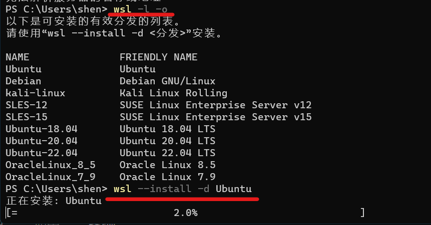

# WSL的基本命令

> 以下WSL命令以 PowerShell 或 Windows 命令提示符支持的格式列出。
> *要从 Bash/Linux 发行版命令行运行这些命令，您必须替换`wsl`为`wsl.exe`. 如需完整的命令列表，请运行`wsl --help`*

## 安装WSL

**安装 WSL 和 Linux 的默认 Ubuntu 发行版**

``` PowerShell
wsl --install
```

**此命令将启用运行 WSL 和安装 Linux 的 Ubuntu 发行版所需的功能。**

执行选项有：

- `-distribution`：指定要安装的 Linux 发行版
- `--no-launch`：安装 Linux 发行版但不要自动启动它
- `--web-download`：从在线资源安装，而不是使用 Microsoft Store
  
未安装WSL时，选项有：

- `--inbox`：使用 Windows 组件而不是使用 Microsoft Store 安装 WSL。*（WSL 更新将通过 Windows 更新接收，而不是通过商店推出）*
- `--enable-wsl1`：通过同时启用“适用于 Linux 的 Windows 子系统”可选组件，在安装 Microsoft Store 版本的 WSL 期间启用 WSL 1
- `--no-distribution`：安装 WSL 时不要安装发行版
  
**安装其他Linux发行版：**

``` PowerShell
wsl --install <Distribution Name>

```

查看有效的分发名称列表：

```PowerShell
wsl --list --online
wsl -l -o
```

## 安装或更改Linux发行版

```PowerShell
wsl --install -d <Distribution Name>
```

替换`<Distribution Name>`为您要安装的发行版的名称
**更改已安装的或新安装其他Linux发行版，都可以这么用。**
如图：


## 列出已安装的Linux发行版

查看 Windows 计算机上安装的 Linux 发行版列表，包括状态（发行版是正在运行还是已停止）和运行发行版的 WSL 版本（WSL 1 或 WSL 2）

```PowerShell
wsl --list --verbose
wsl -l -v
```

`--all`：列出所有发行版

`--running`：仅列出当前正在运行的发行版

`--quiet`：仅显示发行版名称

## 将 WSL 版本设置为 1 或 2

``` PowerShell
wsl --set-version <distribution name> <versionNumber>
```

## 设置默认 WSL 版本

``` PowerShell
wsl --set-default-version <Version>
```

要设置 WSL 1 或 WSL 2 的默认版本，请替换`<Version>`为数字 1 或 2，以表示希望安装的 WSL 版本默认用于新的 Linux 发行版安装。例如，`wsl --set-default-version 2`

## 设置默认 Linux 发行版

``` PowerShell
wsl --set-default <Distribution Name>
wsl -s <DistributionName>
```

要设置 WSL 命令将用于运行的默认 Linux 发行版，请替换`<Distribution Name>`为您首选的 Linux 发行版的名称。

## 将目录更改为主目录

``` PowerShell
wsl ~
```

`~`可以与 wsl 一起使用以在用户的主目录中启动。要在 WSL 命令提示符下从任何目录跳回到主目录，可以使用命令`cd ~`：

## 从 PowerShell 或 CMD 运行特定的 Linux 发行版

``` PowerShell
wsl --distribution <Distribution Name> --user <User Name>
```

要使用特定用户运行特定的 Linux 发行版，请替换`<Distribution Name>`为首选的 Linux 发行版的名称（即 Debian）和`<User Name>`现有用户的名称（即 root）。如果用户不存在于 WSL 分发中，将收到错误消息。要打印当前用户名，请使用命令`whoami`。

## 更新 WSL

``` PowerShell
wsl --update
```

WSL 版本更新到最新版本。
选项包括：
`--web-download`：从 GitHub 而不是 Microsoft Store 下载最新更新

## 检查 WSL 状态

``` PowerShell
wsl --status
```

## 检查 WSL 版本

``` PowerShell
wsl --version
```

## 帮助命令

``` PowerShell
wsl --help
```

## 以特定用户身份运行

``` PowerShell
wsl -u <Username>`, `wsl --user <Username>
```

要以指定用户身份运行 WSL，请替换`<Username>`为 WSL 分发版中存在的用户名

## 更改分配的默认用户

``` PowerShell
<DistributionName> config --default-user <Username>
```

更改分发登录的默认用户。用户必须已经存在于发行版中才能成为默认用户。
*例如： `ubuntu config --default-user johndoe`将 Ubuntu 发行版的默认用户更改为“johndoe”用户。*

> 如果无法确定您的发行版名称，请使用命令`wsl -l`.

!> 不适用于导入的发行版，因为这些发行版没有可执行的启动器。可以改为使用该`/etc/wsl.conf`文件更改导入分发的默认用户,详见[高级设置配置](https://learn.microsoft.com/en-us/windows/wsl/wsl-config#user-settings)

## 关闭

``` PowerShell
wsl --shutdown
```

立即终止所有正在运行的发行版和 WSL 2 轻量级实用程序虚拟机。
**在需要重新启动 WSL 2 虚拟机环境的情况下，例如更改内存使用限制或更改您的`.wslconfig` 文件，此命令可能是必需的**

## 终止

``` PowerShell
wsl --terminate <Distribution Name>
```

要终止指定的分发或停止运行，请替换`<Distribution Name>`为目标分发的名称。

## 导入和导出分布

``` PowerShell
wsl --export <Distribution Name> <FileName>
```

``` PowerShell
wsl --import <Distribution Name> <InstallLocation> <FileName>
```

将指定的 tar 文件作为新分发导入和导出。

选项有：

- `--vhd`： 指定导入/导出分发应该是 .vhdx 文件而不是 tar 文件
- `--version`：仅用于导入，指定是将分发导入为 WSL 1 还是 WSL 2 分发

## 就地导入分布

``` PowerShell
wsl --import-in-place <Distribution Name> <FileName>
```

将指定的 .vhdx 文件作为新分发导入。虚拟硬盘必须格式化为 ext4 文件系统类型。

## 注销或卸载 Linux 发行版

>虽然可以通过 Microsoft Store 安装 Linux 发行版，但无法通过商店卸载它们。

要注销和卸载 WSL 发行版：

``` PowerShell
wsl --unregister <DistributionName>
```

替换`<DistributionName>`为目标 Linux 发行版的名称将从 WSL 中注销该发行版，以便可以重新安装或清理它。
*例如，`wsl --unregister Ubuntu`将从 WSL 中可用的发行版中删除 Ubuntu。运行`wsl --list`将显示它不再列出。*

!> 注意：一旦取消注册，与该发行版相关的所有数据、设置和软件将永久丢失。

从商店重新安装将安装分发的干净副本。

## 挂载磁盘或设备

``` PowerShell
wsl --mount <DiskPath>
```

`<DiskPath>`通过替换为磁盘所在的目录\文件路径，在所有 WSL2 发行版中附加并装载物理磁盘。
选项包括：

- `--vhd`：指定`<Disk>`指的是虚拟硬盘。
- `--name`：使用挂载点的自定义名称挂载磁盘
- `--bare`：将磁盘附加到 WSL2，但不要挂载它。
- `--type <Filesystem>`：挂载磁盘时使用的文件系统类型，如果未指定则默认为 ext4。可简化为`wsl --mount -t <Filesystem>`。可以使用命令检测文件系统类型`blkid <BlockDevice>`,*如：`blkid <dev/sdb1>`*
- `--partition <Partition Number>`：要挂载的分区的索引号，如果不指定则默认为整个磁盘。
- `--options <MountOptions>`： 安装磁盘时可以包含一些特定于文件系统的选项。*例如，ext4 安装选项如：`wsl --mount -o "data-ordered"`或`wsl --mount -o "data=writeback`. 但是，目前仅支持特定于文件系统的选项。不支持通用选项，例如`ro`、`rw`或`noatime`*

?> 如果正在运行 32 位进程以访问 wsl.exe（一个 64 位工具），可能需要按以下方式运行命令：`C:\Windows\Sysnative\wsl.exe --command`。

## 卸载磁盘

``` PowerShell
wsl --unmount <DiskPath>
```

卸载在磁盘路径中给定的磁盘，**如果没有给出磁盘路径，则此命令将卸载并分离所有已安装的磁盘。**
