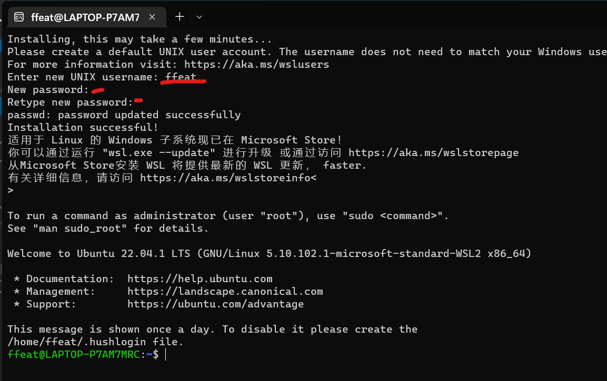
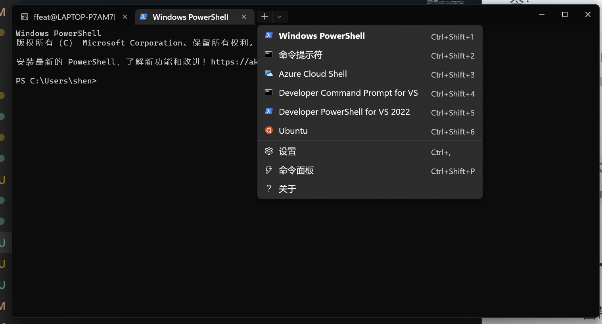
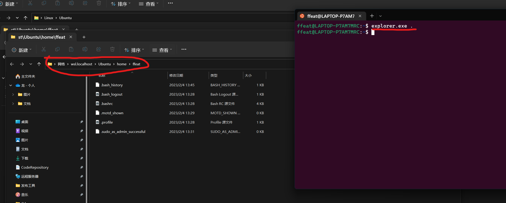

# WSL使用流程概述

> 必须运行 Windows 10 版本 2004 及更高版本（内部版本 19041 及更高版本）或 Windows 11 才能使用以下命令

## 先安装

管理员身份运行power shell或者cmd执行命令：`wsl --install`。
然后重启电脑。
*如果已安装WSL,未安装Linux发行版，就查询可用发行版，再用 `wsl --install -d <DistroName>`安装发行版*
`wsl --install -d <DistroName>`可以安装或更改其他发行版Linux

!> 如果要从 Linux/Bash 命令行（而不是从 PowerShell 或命令提示符）安装其他发行版，则必须在命令中使用 `.exe`：`wsl.exe --install -d <Distribution Name>`或列出可用的发行版：`wsl.exe -l -o`。

如果要安装的不在列出的可用列表里，可以使用TAR文件导入任何Linux发行版，或者使用`.appx`文件进行安装。

## 设置Linux用户信息

安装 WSL 后，需要为新安装的 Linux 发行版创建用户帐户和密码。

在安装完成后，使用开始菜单打开发行版，然后会被要求创建一个用户名和密码

- 每个单独的Linux发行版的账密是彼此独立的，于windows用户名无关。
- 输入密码时，屏幕不会出现任何内容，这叫`盲打`,是正常的。
- 创建后，将会成为该发行版的默认用户，并且启动时自动登录
- 该账号将被作为Linux管理员，具有运行`sudo`（*超级用户执行*）管理命令的权限。

!> 使用 WSL 安装的 Linux 发行版是按用户安装的，不能与其他 Windows 用户帐户共享。
!> 如果账号设置失败，参考该正则匹配`NAME_REGEX="^[a-z][-a-z0-9]*\$"`


这里我设置为ffeat/huozhe123

### 忘记密码

1. 打开 PowerShell 并输入：`wsl -u root`进入默认 WSL 发行版的根目录。
    > 如果修改非默认发行版的密码，请使用`wsl -d Debian -u root`,替换`Debian`为目标发行版的名称。
2. 进入根目录后，输入`passwd <username>`，username为用户名
3. 系统提示输入新密码，然后确认该密码。
4. `exit`关闭wsl

## 更新或升级包

建议使用首选的软件包管理器定期更新和升级
软件包。

对于 Ubuntu 或 Debian，请使用以下命令：

``` Bash
sudo apt update && sudo apt upgrade
```

提示输入密码，继续。

> Windows不会自动更新Linux发行版，大多数Linux用户喜欢自己来控制

## 设置Windows终端

Windows 11自带
可以使用命令行界面运行任何应用程序。其主要功能包括多个选项卡、窗格、Unicode 和 UTF-8 字符支持、GPU 加速文本渲染引擎，以及创建自己的主题和自定义文本、颜色、背景和快捷方式的能力。

每当安装新的 WSL Linux 发行版时，都会在 Windows 终端内为其创建一个新实例，可以根据喜好对其进行自定义。如下图所示：


## 文件存储

在Windows文件管理中打开WSL项目，可以使用命名`explorer.exe .` 。*末尾的句号用来打开当前目录*



!> 为了获得最快的性能速度，在Linux命令行中使用Linux工具处理文件，请将文件存储在WSL文件系统中。
!> 如果使用Windows工具在Windows命令行中工作，请将文件存储在Windows文件系统中。
!> 因为即使可以跨操作系统访问文件，但是可能会显著降低性能。

例如：在存储 WSL 项目文件时：

- 使用 Linux 文件系统根目录：`\\wsl$\<DistroName>\home\<UserName>\Project`
- 不是 Windows 文件系统根目录：`C:\Users\<UserName>\Project`或`/mnt/c/Users/<UserName>/Project$`

### 安装Linux图形界面

详见[在适用于 Linux 的 Windows 子系统上运行 Linux GUI 应用程序](https://learn.microsoft.com/en-us/windows/wsl/tutorials/gui-apps)

## 使用 WSL 运行多个 Linux 发行版的方法

WSL 支持运行任意数量的不同 Linux 发行版。这可能包括从Microsoft Store选择分发、导入自定义分发或构建自己的自定义分发。
安装后，有**多种方法运行Linux发行版：**

1. 使用Windows Terminal(*推荐*).
2. 通过Windows开始菜单。
3. 直接在cmd中输入已安装的发行版名称。如：`ubuntu`
4. 直接在cmd中输入`wsl.exe`打开默认的Linux发行版
5. 在 Windows 命令提示符或 PowerShell 中，可以通过输入 ：`wsl [command]` 在当前命令行中使用默认的 Linux 发行版，而无需输入新的发行版。将 `[command]` 替换为 WSL 命令，例如：`wsl -l -v` 列出已安装的发行版，或 `wsl pwd` 查看当前目录路径在 wsl 中的挂载位置。在PowerShell中，命令`get-date`将提供Windows文档系统的日期，`wsl date`将提供Linux文档系统的日期。
